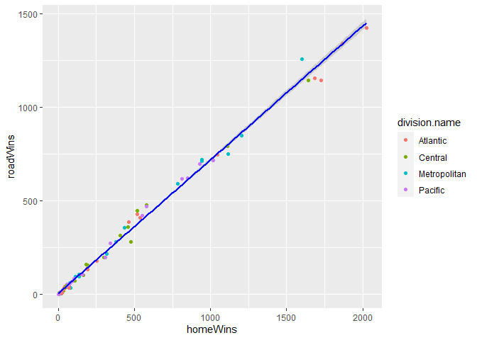
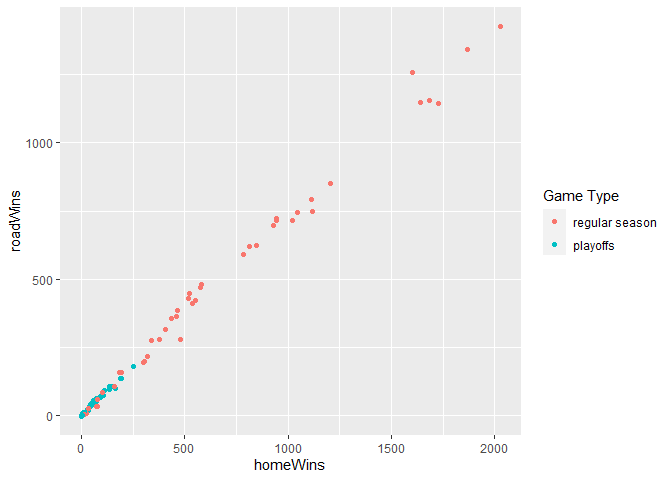
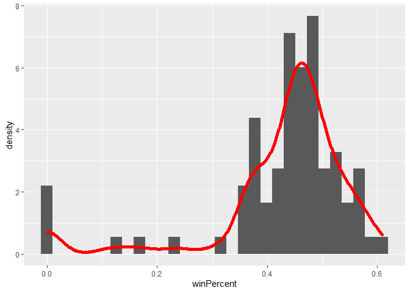
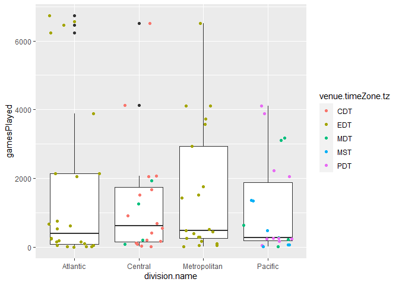
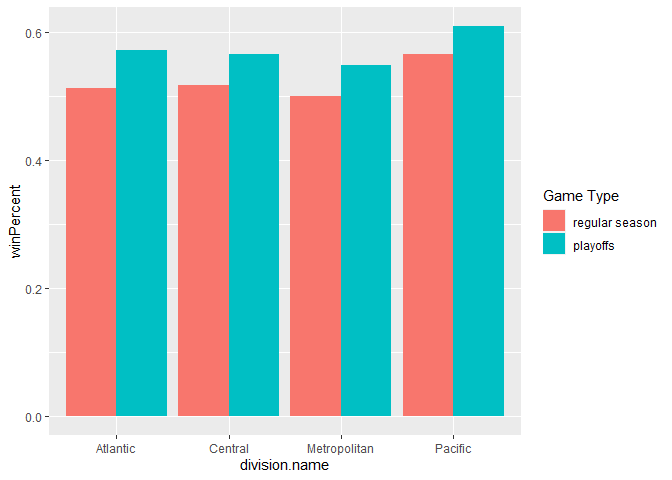
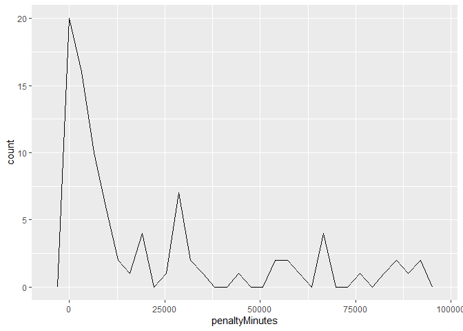

Vignette
================

  - [Required Packages](#required-packages)
  - [Functions](#functions)
      - [NHL records API](#nhl-records-api)
      - [NHL stats API](#nhl-stats-api)
      - [A wrapper function for all the functions
        above](#a-wrapper-function-for-all-the-functions-above)
  - [Exploratory Data Analysis](#exploratory-data-analysis)
      - [Retrieve Information](#retrieve-information)
      - [Summaries](#summaries)
      - [Visualize Data](#visualize-data)

This vignette demonstrates how to access APIs to retrieve data. We use
two NHL repositories as examples: [NHL
records](https://gitlab.com/dword4/nhlapi/-/tree/master) and [NHL
stats](https://gitlab.com/dword4/nhlapi/-/blob/master/stats-api.md).

## Required Packages

To be able to access data from APIs, you should install and load the
`httr`, `jsonlite`, and `tidyverse` packages.

    ```r
    library(httr)
    library(jsonlite)
    library(tidyverse)
    ```

## Functions

### NHL records API

``` r
baseurl_records <- "https://records.nhl.com/site/api"
```

`getFran` retrieves basic information about all teams.

/franchise (Returns id, firstSeasonId and lastSeasonId and name of every
team in the history of the NHL)

``` r
getFran <- function(){
  fullurl <- paste0(baseurl_records, "/", "franchise")
  fran <- GET(fullurl) %>% content("text") %>% fromJSON(flatten = TRUE)
  return(fran$data)
}
getFran() %>% tbl_df()
```

    ## No encoding supplied: defaulting to UTF-8.

`getFranTeamTot` retrieves stats about all teams.

/franchise-team-totals (Returns Total stats for every franchise (ex
roadTies, roadWins, etc))

``` r
getFranTeamTot <- function() {
  fullurl <- paste0(baseurl_records, "/", "franchise-team-totals")
  franTeamTot <- GET(fullurl) %>% content("text") %>% fromJSON(flatten = TRUE)
  return(franTeamTot$data)
}
getFranTeamTot() %>% tbl_df()
```

    ## No encoding supplied: defaulting to UTF-8.

To allow for convenient access of team information in the following
functions, we first construct a subset of data, so users can use team
names or franchise ID to look up information.

``` r
index <- getFranTeamTot() %>% select(c("franchiseId", "teamName")) %>% unique()
```

    ## No encoding supplied: defaulting to UTF-8.

`getFranSeaRec` retrieves season records from one specific team, and
therefore you need to provide the `franchiseId` or `teamName` as an
argument. `franchiseId` can be found using `getFran` or
`getFranTeamTot`.

/site/api/franchise-season-records?cayenneExp=franchiseId=ID (Drill-down
into season records for a specific franchise)

``` r
getFranSeaRec <- function(team) {
  if (is.character(team)) {
    id <- index$franchiseId[index$teamName == team]
  } else if (is.numeric(team)){
    id <- team
  }
  fullurl <- paste0(baseurl_records, "/", "franchise-season-records?cayenneExp=franchiseId=", id)
  franSeaRec <- GET(fullurl) %>% content("text") %>% fromJSON(flatten = TRUE)
  return(franSeaRec$data)
}
getFranSeaRec(20) %>% tbl_df()
```

    ## No encoding supplied: defaulting to UTF-8.

``` r
getFranSeaRec("Vancouver Canucks") %>% tbl_df()
```

    ## No encoding supplied: defaulting to UTF-8.

This function retrieves goalie records, and again a `franchiseId` or
`teamName` is required.  
/franchise-goalie-records?cayenneExp=franchiseId=ID (Goalie records for
the specified franchise)

``` r
getFranGoaRec <- function(team) {
  if (is.character(team)) {
    id <- index$franchiseId[index$teamName == team]
  } else if (is.numeric(team)){
    id <- team
  }
  fullurl <- paste0(baseurl_records, "/", "franchise-goalie-records?cayenneExp=franchiseId=", id)
  franGoaRec <- GET(fullurl) %>% content("text") %>% fromJSON(flatten = TRUE)
  return(franGoaRec$data)
}
getFranGoaRec(20) %>% tbl_df()
```

    ## No encoding supplied: defaulting to UTF-8.

``` r
getFranGoaRec("Vancouver Canucks") %>% tbl_df()
```

    ## No encoding supplied: defaulting to UTF-8.

This function retrieves information about skater records, and a
`franchiseId` or `teamName` is required.  
/franchise-skater-records?cayenneExp=franchiseId=ID (Skater records,
same interaction as goalie endpoint)

``` r
getFranSkaRec <- function(team) {
  if (is.character(team)) {
    id <- index$franchiseId[index$teamName == team]
  } else if (is.numeric(team)){
    id <- team
  }
  fullurl <- paste0(baseurl_records, "/", "franchise-skater-records?cayenneExp=franchiseId=", id)
  franSkaRec <- GET(fullurl) %>% content("text") %>% fromJSON(flatten = TRUE)
  return(franSkaRec$data)
}
getFranSkaRec(20) %>% tbl_df()
```

    ## No encoding supplied: defaulting to UTF-8.

``` r
getFranSkaRec("Vancouver Canucks") %>% tbl_df()
```

    ## No encoding supplied: defaulting to UTF-8.

### NHL stats API

For this function, eight modifiers can be chosen, and thus an argument
(`expand`, `teamID`, or `stats`) has to be provided. Below are the eight
modifiers:

  - ?expand=team.roster Shows roster of active players for the specified
    team  
  - ?expand=person.names Same as above, but gives less info.  
  - ?expand=team.schedule.next Returns details of the upcoming game for
    a team  
  - ?expand=team.schedule.previous Same as above but for the last game
    played  
  - ?expand=team.stats Returns the teams stats for the season  
  - ?expand=team.roster\&season=20142015 Adding the season identifier
    shows the roster for that season  
  - ?teamId=4,5,29 Can string team id together to get multiple teams  
  - ?stats=statsSingleSeasonPlayoffs Specify which stats to get. Not
    fully sure all of the values

Examples of arguments:

  - `ID = 20`  
  - `expand = "person.names"`  
  - `teamId = "4, 5, 29"`  
  - `stats = "statsSingleSeasonPlayoffs"`

Note: If you would like information for more than one team, enter
`teamId`. If you want specific information, such as roster, enter `ID`
and select one team at a time.

For more information about these modifiers, see [the
documentation](https://gitlab.com/dword4/nhlapi/-/blob/master/stats-api.md).

``` r
baseurl_stats <- "https://statsapi.web.nhl.com/api/v1/teams"
getStats <- function(ID = "", expand = "", teamID = "", stats = ""){
  if (ID != ""){
    baseurl_stats <- paste0("https://statsapi.web.nhl.com/api/v1/teams/", ID)
  }
  if (teamID != ""){
    fullurl <- paste0("https://statsapi.web.nhl.com/api/v1/teams?teamId=", teamID)
  }
  
  if (expand != ""){
    fullurl <- paste0(baseurl_stats, "?expand=", expand)
  } else if (stats != ""){
    fullurl <- paste0(baseurl_stats, "?stats=", stats)
  }
  stats <- GET(fullurl) %>% content("text") %>% fromJSON(flatten = TRUE)
  if (str_detect(expand, "team.roster")){
    stats <- stats$teams$roster.roster[[1]]
  } else if (expand == "team.schedule.next"){
    stats <- stats$teams$nextGameSchedule.dates
  } else if (expand == "team.schedule.previous"){
    stats <- stats$teams$previousGameSchedule.dates
  } else if (expand == "team.stats"){
    stats <- stats$teams$teamStats[[1]]$splits[[1]]
    #stats <- stats$teams
  } else {
    stats <- stats$teams
  }
  if (is.null(stats)) {
    stop("No information is available")
  } 
  return(as.data.frame(stats))
}
# getStats(ID = 20, expand = "team.stats")
# getStats(ID = 20, expand = "person.names")
getStats(ID = 24, expand = "team.schedule.previous") %>% tbl_df()
getStats(ID = 20, expand = "team.roster&season=20102011") %>% tbl_df()
# getStats(ID = 53, expand = "team.roster") 
# getStats(teamID = "4,5,29")
# getStats(ID = 54, stats = "statsSingleSeasonPlayoffs") %>% tbl_df()
```

### A wrapper function for all the functions above

Endpoints:

  - franchise (getFran)  
  - team total (getFranTeamTot)  
  - season record (getFranSeaRec)  
  - goalie record (getFranGoaRec)  
  - skater record (getFranSkaRec)  
  - stats (getStats)
      - expand = “team.roster”  
      - expand = “person.names”  
      - expand = “team.schedule.next”  
      - expand = “team.schedule.previous”  
      - expand = “team.stats”  
      - expand = “team.roster”, season = “20142015”  
      - teamId = “4, 5, 29”  
      - stats = “statsSingleSeasonPlayoffs”

See more details in the documentation of [NHL
records](https://gitlab.com/dword4/nhlapi/-/blob/master/records-api.md)
and [NHL
stats](https://gitlab.com/dword4/nhlapi/-/blob/master/stats-api.md).

``` r
# add a 
nhlFun <- function(endpoints, ...){
  if (endpoints == "franchise") {
    getFran()
  } else if (endpoints == "team total") {
    getFranTeamTot()
  } else if (endpoints == "season record"){
    getFranSeaRec(...)
  } else if (endpoints == "goalie record"){
    getFranGoaRec(...)
  } else if (endpoints == "skater record"){
    getFranSkaRec(...)
  } else if (endpoints == "stats"){
    getStats(...)
  } else {
    stop("Please enter a valid endpoint")
  }
}
nhlFun(endpoints = "skater record", 20) %>% tbl_df()
```

    ## No encoding supplied: defaulting to UTF-8.

``` r
nhlFun(endpoints = "stats", expand = "person.team") %>% tbl_df()
# nhlFun(endpoints = "team total")
```

## Exploratory Data Analysis

### Retrieve Information

Now we demonstrate how to use functions above to do exploratory data
analysis. We will first retrieve data from two endpoints: **team total**
and **person.names**, remove some columns we don’t need, and combine the
two objects. Then we’ll add two new variables: `winPercent`: the
proportion of wins among all games played and `homeWinPercent`: the
proportion of wins of home games among all wins.

``` r
# perhaps use the wrapper function here
franTot <- nhlFun(endpoint = "team total")
```

    ## No encoding supplied: defaulting to UTF-8.

``` r
franTot <- franTot %>% select(-c("id", "activeFranchise", "firstSeasonId", "lastSeasonId"))
franStats <- nhlFun(endpoint = "stats", expand = "person.names") 
franStats <- franStats %>% select(c("locationName", "firstYearOfPlay", "franchiseId", "venue.city", "venue.timeZone.id", "venue.timeZone.tz", "division.name", "conference.name"))
# create two variables: winPercent and homeWinPercent 
combined <- inner_join(franTot, franStats, by = "franchiseId") %>% mutate(winPercent = wins / gamesPlayed, homeWinPercent = homeWins / wins)
head(combined)

# create a subset for numbers of games lost or won
subset <- combined %>% select(starts_with("home"), starts_with("road"), "division.name", -"homeWinPercent") %>% gather(-"division.name", key = "type", value = "game") %>% group_by(division.name, type) %>% summarise(sum = sum(game, na.rm = TRUE))
```

    ## `summarise()` regrouping output by 'division.name' (override with `.groups` argument)

### Summaries

``` r
# summaries
apply(combined[,c(3, 6:12, 14:18)], FUN = summary, MARGIN = 2)
```

    ## $gamesPlayed
    ##    Min. 1st Qu.  Median    Mean 3rd Qu.    Max. 
    ##     2.0   152.5   480.0  1395.0  2054.0  6731.0 
    ## 
    ## $homeLosses
    ##    Min. 1st Qu.  Median    Mean 3rd Qu.    Max. 
    ##     0.0    33.0   104.0   239.7   363.0  1132.0 
    ## 
    ## $homeOvertimeLosses
    ##    Min. 1st Qu.  Median    Mean 3rd Qu.    Max.    NA's 
    ##    0.00    0.00    7.00   35.70   73.75  112.00      21 
    ## 
    ## $homeTies
    ##    Min. 1st Qu.  Median    Mean 3rd Qu.    Max.    NA's 
    ##     0.0    11.0    58.0   107.5   166.5   448.0      36 
    ## 
    ## $homeWins
    ##    Min. 1st Qu.  Median    Mean 3rd Qu.    Max. 
    ##     0.0    33.5   112.0   367.8   520.0  2025.0 
    ## 
    ## $losses
    ##    Min. 1st Qu.  Median    Mean 3rd Qu.    Max. 
    ##     1.0    70.5   236.0   575.5   830.0  2736.0 
    ## 
    ## $overtimeLosses
    ##    Min. 1st Qu.  Median    Mean 3rd Qu.    Max.    NA's 
    ##    0.00    0.00   11.50   73.18  158.00  203.00      21 
    ## 
    ## $penaltyMinutes
    ##    Min. 1st Qu.  Median    Mean 3rd Qu.    Max. 
    ##      12    1722    7217   20812   29416   91941 
    ## 
    ## $points
    ##    Min. 1st Qu.  Median    Mean 3rd Qu.    Max.    NA's 
    ##     0.0     0.0    58.5  1372.6  2170.5  7899.0       1 
    ## 
    ## $roadLosses
    ##    Min. 1st Qu.  Median    Mean 3rd Qu.    Max. 
    ##     1.0    38.0   128.0   335.8   467.0  1619.0 
    ## 
    ## $roadOvertimeLosses
    ##    Min. 1st Qu.  Median    Mean 3rd Qu.    Max.    NA's 
    ##    0.00    0.00    6.50   37.74   78.75   95.00      21 
    ## 
    ## $roadTies
    ##    Min. 1st Qu.  Median    Mean 3rd Qu.    Max.    NA's 
    ##     0.0     7.0    55.0   108.8   174.0   456.0      36 
    ## 
    ## $roadWins
    ##    Min. 1st Qu.  Median    Mean 3rd Qu.    Max. 
    ##     0.0    26.5    95.0   269.4   416.5  1424.0

``` r
# contingency table
table(combined$division.name, combined$firstYearOfPlay)
```

    ##               
    ##                1909 1917 1924 1926 1967 1970 1972 1974 1979 1980 1982 1990 1991 1993
    ##   Atlantic        2    6    2    6    0    2    0    0    0    0    0    2    2    2
    ##   Central         0    0    0    2    6    0    0    0    4    0    0    0    0    0
    ##   Metropolitan    0    0    0    2    4    0    2    2    4    0    5    0    0    0
    ##   Pacific         0    0    0    0    2    2    0    0    8    4    0    2    0    2
    ##               
    ##                1997 2011 2016
    ##   Atlantic        0    0    0
    ##   Central         4    4    0
    ##   Metropolitan    2    0    0
    ##   Pacific         0    0    2

``` r
table(combined$conference.name, combined$firstYearOfPlay)
```

    ##          
    ##           1909 1917 1924 1926 1967 1970 1972 1974 1979 1980 1982 1990 1991 1993 1997
    ##   Eastern    2    6    2    8    4    2    2    2    4    0    5    2    2    2    2
    ##   Western    0    0    0    2    8    2    0    0   12    4    0    2    0    2    4
    ##          
    ##           2011 2016
    ##   Eastern    0    0
    ##   Western    4    2

### Visualize Data

Now we have the data, we can make some plots to visualize the data.

In these two scatter plots, we can see that the numbers of wins at home
and on the road are proportional.

``` r
# scatter plot of homeWins and roadWins
ggplot(combined, aes(x = homeWins, y = roadWins)) + geom_point(aes(color = division.name), position = "jitter") +geom_smooth(method = lm, color = "blue")
```

    ## `geom_smooth()` using formula 'y ~ x'

<!-- -->

``` r
ggplot(combined, aes(x = homeWins, y = roadWins)) + geom_point(aes(color = as.factor(gameTypeId)), position = "jitter") + scale_color_discrete(name = "Game Type", labels = c("regular season", "playoffs"))
```

<!-- -->

``` r
# histogram of winPercent
ggplot(combined, aes(x = winPercent)) + geom_histogram(aes(y = ..density..)) + geom_density(kernel = "gaussian", lwd = 2, color = "red")
```

    ## `stat_bin()` using `bins = 30`. Pick better value with `binwidth`.

<!-- -->

``` r
# boxplots of gamesPlayed by division
ggplot(combined, aes(x = division.name, y = gamesPlayed)) + geom_boxplot() + geom_jitter(aes(color = venue.timeZone.tz))
```

<!-- -->

``` r
# barplot of gamePlayed
# ggplot(combined, aes(x = gamesPlayed)) + geom_bar(aes(x = division.name))
ggplot(subset, aes(y = sum, fill = type)) + geom_bar(position = "stack", stat = "identity", aes(x = division.name))
```

<!-- -->

``` r
ggplot(combined, aes(x = division.name, y = winPercent, fill = as.factor(gameTypeId))) + geom_bar(position = "dodge", stat = "identity") + scale_fill_discrete(name = "Game Type", labels = c("regular season", "playoffs"))
```

<!-- -->

``` r
# frequency plot for penalty minutes
ggplot(combined, aes(x = penaltyMinutes)) + geom_freqpoly()
```

    ## `stat_bin()` using `bins = 30`. Pick better value with `binwidth`.

<!-- -->
