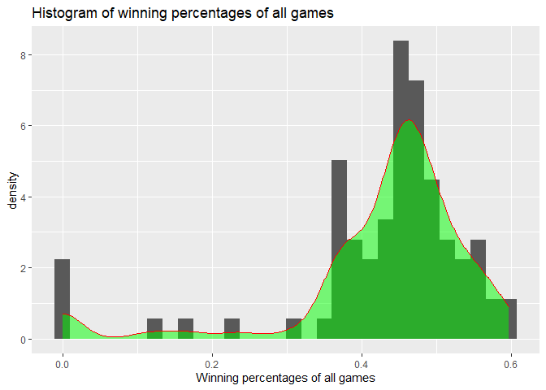
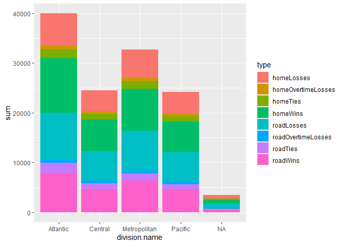

Vignette
================

  - [Required Packages](#required-packages)
  - [Functions](#functions)
      - [NHL records API](#nhl-records-api)
      - [NHL stats API](#nhl-stats-api)
  - [A wrapper function for all the functions
    above](#a-wrapper-function-for-all-the-functions-above)
  - [Exploratory Data Analysis](#exploratory-data-analysis)
      - [Retrieve Information](#retrieve-information)
      - [Summaries](#summaries)
      - [Visualize Data](#visualize-data)

In this vignette, we want to show how to access APIs to retrieve data.
We use two NHL repositories as examples: [NHL
records](https://gitlab.com/dword4/nhlapi/-/tree/master) and [NHL
stats](https://gitlab.com/dword4/nhlapi/-/blob/master/stats-api.md).

## Required Packages

To be able to access data from APIs, you should install and load the
`httr`, `jsonlite`, and `tidyverse` packages.

    ```r
    library(httr)
    library(jsonlite)
    library(tidyverse)
    ```

## Functions

### NHL records API

``` r
baseurl_records <- "https://records.nhl.com/site/api"
```

Here is a function to get basic information about all teams.  
/franchise (Returns id, firstSeasonId and lastSeasonId and name of every
team in the history of the NHL)

``` r
getFran <- function(){
  fullurl <- paste0(baseurl_records, "/", "franchise")
  fran <- GET(fullurl) %>% content("text") %>% fromJSON(flatten = TRUE)
  return(fran$data)
}
getFran() %>% tbl_df()
```

    ## No encoding supplied: defaulting to UTF-8.

    ## # A tibble: 38 x 6
    ##       id firstSeasonId lastSeasonId mostRecentTeamId
    ##    <int>         <int>        <int>            <int>
    ##  1     1      19171918           NA                8
    ##  2     2      19171918     19171918               41
    ##  3     3      19171918     19341935               45
    ##  4     4      19191920     19241925               37
    ##  5     5      19171918           NA               10
    ##  6     6      19241925           NA                6
    ##  7     7      19241925     19371938               43
    ##  8     8      19251926     19411942               51
    ##  9     9      19251926     19301931               39
    ## 10    10      19261927           NA                3
    ## # ... with 28 more rows, and 2 more variables:
    ## #   teamCommonName <chr>, teamPlaceName <chr>

This is a function to retrieve stats about all teams.  
/franchise-team-totals (Returns Total stats for every franchise (ex
roadTies, roadWins, etc))

``` r
getFranTeamTot <- function() {
  fullurl <- paste0(baseurl_records, "/", "franchise-team-totals")
  franTeamTot <- GET(fullurl) %>% content("text") %>% fromJSON(flatten = TRUE)
  return(franTeamTot$data)
}
getFranTeamTot() %>% tbl_df()
```

    ## No encoding supplied: defaulting to UTF-8.

    ## # A tibble: 105 x 30
    ##       id activeFranchise firstSeasonId franchiseId
    ##    <int>           <int>         <int>       <int>
    ##  1     1               1      19821983          23
    ##  2     2               1      19821983          23
    ##  3     3               1      19721973          22
    ##  4     4               1      19721973          22
    ##  5     5               1      19261927          10
    ##  6     6               1      19261927          10
    ##  7     7               1      19671968          16
    ##  8     8               1      19671968          16
    ##  9     9               1      19671968          17
    ## 10    10               1      19671968          17
    ## # ... with 95 more rows, and 26 more variables:
    ## #   gameTypeId <int>, gamesPlayed <int>,
    ## #   goalsAgainst <int>, goalsFor <int>, homeLosses <int>,
    ## #   homeOvertimeLosses <int>, homeTies <int>,
    ## #   homeWins <int>, lastSeasonId <int>, losses <int>,
    ## #   overtimeLosses <int>, penaltyMinutes <int>,
    ## #   pointPctg <dbl>, points <int>, roadLosses <int>,
    ## #   roadOvertimeLosses <int>, roadTies <int>,
    ## #   roadWins <int>, shootoutLosses <int>,
    ## #   shootoutWins <int>, shutouts <int>, teamId <int>,
    ## #   teamName <chr>, ties <int>, triCode <chr>, wins <int>

To allow for convenient access of team information in the following
function, we first construct a subset of data, so users can use team
names or franchise ID to look up information.

``` r
index <- getFranTeamTot() %>% select(c("franchiseId", "teamName")) %>% unique()
```

    ## No encoding supplied: defaulting to UTF-8.

This function retrieves season records from one specific team, and
therefore you need to provide the `franchiseId` or `teamName` as an
argument. The ID can be found using `getFran` or `getFranTeamTot`.  
/site/api/franchise-season-records?cayenneExp=franchiseId=ID (Drill-down
into season records for a specific franchise)

``` r
getFranSeaRec <- function(team) {
  if (is.character(team)) {
    id <- index$franchiseId[index$teamName == team]
  } else if (is.numeric(team)){
    id <- team
  }
  fullurl <- paste0(baseurl_records, "/", "franchise-season-records?cayenneExp=franchiseId=", id)
  franSeaRec <- GET(fullurl) %>% content("text") %>% fromJSON(flatten = TRUE)
  return(franSeaRec$data)
}
getFranSeaRec(20) %>% tbl_df()
```

    ## No encoding supplied: defaulting to UTF-8.

    ## # A tibble: 1 x 57
    ##      id fewestGoals fewestGoalsAgai~ fewestGoalsAgai~
    ##   <int>       <int>            <int> <chr>           
    ## 1    23         182              185 2010-11 (82)    
    ## # ... with 53 more variables: fewestGoalsSeasons <chr>,
    ## #   fewestLosses <int>, fewestLossesSeasons <chr>,
    ## #   fewestPoints <int>, fewestPointsSeasons <chr>,
    ## #   fewestTies <int>, fewestTiesSeasons <chr>,
    ## #   fewestWins <int>, fewestWinsSeasons <chr>,
    ## #   franchiseId <int>, franchiseName <chr>,
    ## #   homeLossStreak <int>, homeLossStreakDates <chr>,
    ## #   homePointStreak <int>, homePointStreakDates <chr>,
    ## #   homeWinStreak <int>, homeWinStreakDates <chr>,
    ## #   homeWinlessStreak <int>, homeWinlessStreakDates <chr>,
    ## #   lossStreak <int>, lossStreakDates <chr>,
    ## #   mostGameGoals <int>, mostGameGoalsDates <chr>,
    ## #   mostGoals <int>, mostGoalsAgainst <int>,
    ## #   mostGoalsAgainstSeasons <chr>, mostGoalsSeasons <chr>,
    ## #   mostLosses <int>, mostLossesSeasons <chr>,
    ## #   mostPenaltyMinutes <int>,
    ## #   mostPenaltyMinutesSeasons <chr>, mostPoints <int>,
    ## #   mostPointsSeasons <chr>, mostShutouts <int>,
    ## #   mostShutoutsSeasons <chr>, mostTies <int>,
    ## #   mostTiesSeasons <chr>, mostWins <int>,
    ## #   mostWinsSeasons <chr>, pointStreak <int>,
    ## #   pointStreakDates <chr>, roadLossStreak <int>,
    ## #   roadLossStreakDates <chr>, roadPointStreak <int>,
    ## #   roadPointStreakDates <chr>, roadWinStreak <int>,
    ## #   roadWinStreakDates <chr>, roadWinlessStreak <int>,
    ## #   roadWinlessStreakDates <chr>, winStreak <int>,
    ## #   winStreakDates <chr>, winlessStreak <lgl>,
    ## #   winlessStreakDates <lgl>

``` r
getFranSeaRec("Vancouver Canucks") %>% tbl_df()
```

    ## No encoding supplied: defaulting to UTF-8.

    ## # A tibble: 1 x 57
    ##      id fewestGoals fewestGoalsAgai~ fewestGoalsAgai~
    ##   <int>       <int>            <int> <chr>           
    ## 1    23         182              185 2010-11 (82)    
    ## # ... with 53 more variables: fewestGoalsSeasons <chr>,
    ## #   fewestLosses <int>, fewestLossesSeasons <chr>,
    ## #   fewestPoints <int>, fewestPointsSeasons <chr>,
    ## #   fewestTies <int>, fewestTiesSeasons <chr>,
    ## #   fewestWins <int>, fewestWinsSeasons <chr>,
    ## #   franchiseId <int>, franchiseName <chr>,
    ## #   homeLossStreak <int>, homeLossStreakDates <chr>,
    ## #   homePointStreak <int>, homePointStreakDates <chr>,
    ## #   homeWinStreak <int>, homeWinStreakDates <chr>,
    ## #   homeWinlessStreak <int>, homeWinlessStreakDates <chr>,
    ## #   lossStreak <int>, lossStreakDates <chr>,
    ## #   mostGameGoals <int>, mostGameGoalsDates <chr>,
    ## #   mostGoals <int>, mostGoalsAgainst <int>,
    ## #   mostGoalsAgainstSeasons <chr>, mostGoalsSeasons <chr>,
    ## #   mostLosses <int>, mostLossesSeasons <chr>,
    ## #   mostPenaltyMinutes <int>,
    ## #   mostPenaltyMinutesSeasons <chr>, mostPoints <int>,
    ## #   mostPointsSeasons <chr>, mostShutouts <int>,
    ## #   mostShutoutsSeasons <chr>, mostTies <int>,
    ## #   mostTiesSeasons <chr>, mostWins <int>,
    ## #   mostWinsSeasons <chr>, pointStreak <int>,
    ## #   pointStreakDates <chr>, roadLossStreak <int>,
    ## #   roadLossStreakDates <chr>, roadPointStreak <int>,
    ## #   roadPointStreakDates <chr>, roadWinStreak <int>,
    ## #   roadWinStreakDates <chr>, roadWinlessStreak <int>,
    ## #   roadWinlessStreakDates <chr>, winStreak <int>,
    ## #   winStreakDates <chr>, winlessStreak <lgl>,
    ## #   winlessStreakDates <lgl>

This function retrieves goalie records, and again a `franchiseId` or
`teamName` is required.  
/franchise-goalie-records?cayenneExp=franchiseId=ID (Goalie records for
the specified franchise)

``` r
getFranGoaRec <- function(team) {
  if (is.character(team)) {
    id <- index$franchiseId[index$teamName == team]
  } else if (is.numeric(team)){
    id <- team
  }
  fullurl <- paste0(baseurl_records, "/", "franchise-goalie-records?cayenneExp=franchiseId=", id)
  franGoaRec <- GET(fullurl) %>% content("text") %>% fromJSON(flatten = TRUE)
  return(franGoaRec$data)
}
getFranGoaRec(20) %>% tbl_df()
```

    ## No encoding supplied: defaulting to UTF-8.

    ## # A tibble: 39 x 29
    ##       id activePlayer firstName franchiseId franchiseName
    ##    <int> <lgl>        <chr>           <int> <chr>        
    ##  1   243 FALSE        Kirk               20 Vancouver Ca~
    ##  2   297 FALSE        Roberto            20 Vancouver Ca~
    ##  3   304 FALSE        Richard            20 Vancouver Ca~
    ##  4   364 FALSE        Gary               20 Vancouver Ca~
    ##  5   367 FALSE        Sean               20 Vancouver Ca~
    ##  6   373 FALSE        Jacques            20 Vancouver Ca~
    ##  7   406 FALSE        Bob                20 Vancouver Ca~
    ##  8   423 FALSE        Troy               20 Vancouver Ca~
    ##  9   424 FALSE        John               20 Vancouver Ca~
    ## 10   500 FALSE        Bob                20 Vancouver Ca~
    ## # ... with 29 more rows, and 24 more variables:
    ## #   gameTypeId <int>, gamesPlayed <int>, lastName <chr>,
    ## #   losses <int>, mostGoalsAgainstDates <chr>,
    ## #   mostGoalsAgainstOneGame <int>, mostSavesDates <chr>,
    ## #   mostSavesOneGame <int>, mostShotsAgainstDates <chr>,
    ## #   mostShotsAgainstOneGame <int>,
    ## #   mostShutoutsOneSeason <int>,
    ## #   mostShutoutsSeasonIds <chr>, mostWinsOneSeason <int>,
    ## #   mostWinsSeasonIds <chr>, overtimeLosses <int>,
    ## #   playerId <int>, positionCode <chr>,
    ## #   rookieGamesPlayed <int>, rookieShutouts <int>,
    ## #   rookieWins <int>, seasons <int>, shutouts <int>,
    ## #   ties <int>, wins <int>

``` r
getFranGoaRec("Vancouver Canucks") %>% tbl_df()
```

    ## No encoding supplied: defaulting to UTF-8.

    ## # A tibble: 39 x 29
    ##       id activePlayer firstName franchiseId franchiseName
    ##    <int> <lgl>        <chr>           <int> <chr>        
    ##  1   243 FALSE        Kirk               20 Vancouver Ca~
    ##  2   297 FALSE        Roberto            20 Vancouver Ca~
    ##  3   304 FALSE        Richard            20 Vancouver Ca~
    ##  4   364 FALSE        Gary               20 Vancouver Ca~
    ##  5   367 FALSE        Sean               20 Vancouver Ca~
    ##  6   373 FALSE        Jacques            20 Vancouver Ca~
    ##  7   406 FALSE        Bob                20 Vancouver Ca~
    ##  8   423 FALSE        Troy               20 Vancouver Ca~
    ##  9   424 FALSE        John               20 Vancouver Ca~
    ## 10   500 FALSE        Bob                20 Vancouver Ca~
    ## # ... with 29 more rows, and 24 more variables:
    ## #   gameTypeId <int>, gamesPlayed <int>, lastName <chr>,
    ## #   losses <int>, mostGoalsAgainstDates <chr>,
    ## #   mostGoalsAgainstOneGame <int>, mostSavesDates <chr>,
    ## #   mostSavesOneGame <int>, mostShotsAgainstDates <chr>,
    ## #   mostShotsAgainstOneGame <int>,
    ## #   mostShutoutsOneSeason <int>,
    ## #   mostShutoutsSeasonIds <chr>, mostWinsOneSeason <int>,
    ## #   mostWinsSeasonIds <chr>, overtimeLosses <int>,
    ## #   playerId <int>, positionCode <chr>,
    ## #   rookieGamesPlayed <int>, rookieShutouts <int>,
    ## #   rookieWins <int>, seasons <int>, shutouts <int>,
    ## #   ties <int>, wins <int>

This function retrieves information about skater records, and a
`franchiseId` or `teamName` is required.  
/franchise-skater-records?cayenneExp=franchiseId=ID (Skater records,
same interaction as goalie endpoint)

``` r
getFranSkaRec <- function(team) {
  if (is.character(team)) {
    id <- index$franchiseId[index$teamName == team]
  } else if (is.numeric(team)){
    id <- team
  }
  fullurl <- paste0(baseurl_records, "/", "franchise-skater-records?cayenneExp=franchiseId=", id)
  franSkaRec <- GET(fullurl) %>% content("text") %>% fromJSON(flatten = TRUE)
  return(franSkaRec$data)
}
getFranSkaRec(20) %>% tbl_df()
```

    ## No encoding supplied: defaulting to UTF-8.

    ## # A tibble: 561 x 30
    ##       id activePlayer assists firstName franchiseId
    ##    <int> <lgl>          <int> <chr>           <int>
    ##  1 16941 FALSE            648 Daniel             20
    ##  2 16942 FALSE            830 Henrik             20
    ##  3 17026 FALSE             52 Gino               20
    ##  4 17057 FALSE            224 Pavel              20
    ##  5 17115 FALSE             53 Donald             20
    ##  6 17141 FALSE            410 Markus             20
    ##  7 17178 FALSE            242 Doug               20
    ##  8 17222 FALSE             18 Claire             20
    ##  9 17238 FALSE              1 Jim                20
    ## 10 17241 FALSE            190 Greg               20
    ## # ... with 551 more rows, and 25 more variables:
    ## #   franchiseName <chr>, gameTypeId <int>,
    ## #   gamesPlayed <int>, goals <int>, lastName <chr>,
    ## #   mostAssistsGameDates <chr>, mostAssistsOneGame <int>,
    ## #   mostAssistsOneSeason <int>, mostAssistsSeasonIds <chr>,
    ## #   mostGoalsGameDates <chr>, mostGoalsOneGame <int>,
    ## #   mostGoalsOneSeason <int>, mostGoalsSeasonIds <chr>,
    ## #   mostPenaltyMinutesOneSeason <int>,
    ## #   mostPenaltyMinutesSeasonIds <chr>,
    ## #   mostPointsGameDates <chr>, mostPointsOneGame <int>,
    ## #   mostPointsOneSeason <int>, mostPointsSeasonIds <chr>,
    ## #   penaltyMinutes <int>, playerId <int>, points <int>,
    ## #   positionCode <chr>, rookiePoints <int>, seasons <int>

``` r
getFranSkaRec("Vancouver Canucks") %>% tbl_df()
```

    ## No encoding supplied: defaulting to UTF-8.

    ## # A tibble: 561 x 30
    ##       id activePlayer assists firstName franchiseId
    ##    <int> <lgl>          <int> <chr>           <int>
    ##  1 16941 FALSE            648 Daniel             20
    ##  2 16942 FALSE            830 Henrik             20
    ##  3 17026 FALSE             52 Gino               20
    ##  4 17057 FALSE            224 Pavel              20
    ##  5 17115 FALSE             53 Donald             20
    ##  6 17141 FALSE            410 Markus             20
    ##  7 17178 FALSE            242 Doug               20
    ##  8 17222 FALSE             18 Claire             20
    ##  9 17238 FALSE              1 Jim                20
    ## 10 17241 FALSE            190 Greg               20
    ## # ... with 551 more rows, and 25 more variables:
    ## #   franchiseName <chr>, gameTypeId <int>,
    ## #   gamesPlayed <int>, goals <int>, lastName <chr>,
    ## #   mostAssistsGameDates <chr>, mostAssistsOneGame <int>,
    ## #   mostAssistsOneSeason <int>, mostAssistsSeasonIds <chr>,
    ## #   mostGoalsGameDates <chr>, mostGoalsOneGame <int>,
    ## #   mostGoalsOneSeason <int>, mostGoalsSeasonIds <chr>,
    ## #   mostPenaltyMinutesOneSeason <int>,
    ## #   mostPenaltyMinutesSeasonIds <chr>,
    ## #   mostPointsGameDates <chr>, mostPointsOneGame <int>,
    ## #   mostPointsOneSeason <int>, mostPointsSeasonIds <chr>,
    ## #   penaltyMinutes <int>, playerId <int>, points <int>,
    ## #   positionCode <chr>, rookiePoints <int>, seasons <int>

### NHL stats API

For this function, eight modifiers can be chosen, and thus an argument
(`expand`, `teamID`, or `stats`) has to be provided. Below are the eight
modifiers:

  - ?expand=team.roster Shows roster of active players for the specified
    team  
  - ?expand=person.names Same as above, but gives less info.  
  - ?expand=team.schedule.next Returns details of the upcoming game for
    a team  
  - ?expand=team.schedule.previous Same as above but for the last game
    played  
  - ?expand=team.stats Returns the teams stats for the season  
  - ?expand=team.roster\&season=20142015 Adding the season identifier
    shows the roster for that season  
  - ?teamId=4,5,29 Can string team id together to get multiple teams  
  - ?stats=statsSingleSeasonPlayoffs Specify which stats to get. Not
    fully sure all of the values

Examples of arguments:

  - `expand = "person.names"`  
  - `teamId = "4, 5, 29"`  
  - `stats = "statsSingleSeasonPlayoffs"`

For more information about these modifiers, see [the
documentation](https://gitlab.com/dword4/nhlapi/-/blob/master/stats-api.md).

``` r
baseurl_stats <- "https://statsapi.web.nhl.com/api/v1/teams"
getStats <- function(expand = "", teamID = "", stats = ""){
  if (teamID!=""){
    if (length(teamID)==1){
      baseurl_stats <- paste0("https://statsapi.web.nhl.com/api/v1/teams/", teamID)
    }
    else{
      fullurl <- paste0("https://statsapi.web.nhl.com/api/v1/teams?teamID=", teamID)
    }
  }
  if (expand != ""){
    fullurl <- paste0(baseurl_stats, "?expand=", expand)
  } else if (stats != ""){
    fullurl <- paste0(baseurl_stats, "?stats=", stats)
  }
  stats <- GET(fullurl) %>% content("text") %>% fromJSON(flatten = TRUE)
  if (expand == "team.roster"){
    stats <- stats$teams$roster.roster
  } else if (expand == "team.schedule.next"){
    stats <- stats$teams$nextGameSchedule.dates
  } else if (expand == "team.schedule.previous"){
    stats <- stats$teams$previousGameSchedule.dates
  } else if (expand == "team.stats"){
    stats <- stats$teams$teamStats[[1]]$splits[[1]]
  } else {
    stats <- as.data.frame(stats$teams)
  }
  if (is.null(stats)) {
    stop("No information is available")
  } 
  return(stats)
}
# getStats(teamID = 20, expand = "team.stats")
# getStats(teamID = 20, expand = "person.names")
# getStats(teamID = 20, expand = "team.schedule.next")
getStats(expand = "team.roster&season=20142015") %>% tbl_df()
```

    ## # A tibble: 30 x 31
    ##       id name  link  abbreviation teamName locationName
    ##    <int> <chr> <chr> <chr>        <chr>    <chr>       
    ##  1     1 New ~ /api~ NJD          Devils   New Jersey  
    ##  2     2 New ~ /api~ NYI          Islande~ New York    
    ##  3     3 New ~ /api~ NYR          Rangers  New York    
    ##  4     4 Phil~ /api~ PHI          Flyers   Philadelphia
    ##  5     5 Pitt~ /api~ PIT          Penguins Pittsburgh  
    ##  6     6 Bost~ /api~ BOS          Bruins   Boston      
    ##  7     7 Buff~ /api~ BUF          Sabres   Buffalo     
    ##  8     8 Mont~ /api~ MTL          Canadie~ Montréal    
    ##  9     9 Otta~ /api~ OTT          Senators Ottawa      
    ## 10    10 Toro~ /api~ TOR          Maple L~ Toronto     
    ## # ... with 20 more rows, and 25 more variables:
    ## #   firstYearOfPlay <chr>, shortName <chr>,
    ## #   officialSiteUrl <chr>, franchiseId <int>, active <lgl>,
    ## #   venue.name <chr>, venue.link <chr>, venue.city <chr>,
    ## #   venue.id <int>, venue.timeZone.id <chr>,
    ## #   venue.timeZone.offset <int>, venue.timeZone.tz <chr>,
    ## #   division.id <int>, division.name <chr>,
    ## #   division.nameShort <chr>, division.link <chr>,
    ## #   division.abbreviation <chr>, conference.id <int>,
    ## #   conference.name <chr>, conference.link <chr>,
    ## #   franchise.franchiseId <int>, franchise.teamName <chr>,
    ## #   franchise.link <chr>, roster.roster <list>,
    ## #   roster.link <chr>

``` r
getStats(teamID = 53, expand = "team.roster") 
```

    ## [[1]]
    ##    jerseyNumber person.id      person.fullName
    ## 1            15   8470755      Brad Richardson
    ## 2            34   8471262       Carl Soderberg
    ## 3            33   8471274       Alex Goligoski
    ## 4             4   8471769   Niklas Hjalmarsson
    ## 5            40   8473546      Michael Grabner
    ## 6            81   8473548          Phil Kessel
    ## 7            55   8474218         Jason Demers
    ## 8            21   8474613         Derek Stepan
    ## 9            23   8475171 Oliver Ekman-Larsson
    ## 10           35   8475311        Darcy Kuemper
    ## 11           91   8475791          Taylor Hall
    ## 12           13   8476994    Vinnie Hinostroza
    ## 13           32   8477293         Antti Raanta
    ## 14           82   8477851      Jordan Oesterle
    ## 15            8   8477951        Nick Schmaltz
    ## 16           18   8477989     Christian Dvorak
    ## 17           36   8478432    Christian Fischer
    ## 18           67   8478474        Lawson Crouse
    ## 19           83   8478856        Conor Garland
    ## 20            9   8479343       Clayton Keller
    ## 21            6   8479345       Jakob Chychrun
    ## 22           29   8480849       Barrett Hayton
    ## 23           46   8480950      Ilya Lyubushkin
    ##               person.link position.code position.name
    ## 1  /api/v1/people/8470755             C        Center
    ## 2  /api/v1/people/8471262             C        Center
    ## 3  /api/v1/people/8471274             D    Defenseman
    ## 4  /api/v1/people/8471769             D    Defenseman
    ## 5  /api/v1/people/8473546             L     Left Wing
    ## 6  /api/v1/people/8473548             R    Right Wing
    ## 7  /api/v1/people/8474218             D    Defenseman
    ## 8  /api/v1/people/8474613             C        Center
    ## 9  /api/v1/people/8475171             D    Defenseman
    ## 10 /api/v1/people/8475311             G        Goalie
    ## 11 /api/v1/people/8475791             L     Left Wing
    ## 12 /api/v1/people/8476994             R    Right Wing
    ## 13 /api/v1/people/8477293             G        Goalie
    ## 14 /api/v1/people/8477851             D    Defenseman
    ## 15 /api/v1/people/8477951             C        Center
    ## 16 /api/v1/people/8477989             C        Center
    ## 17 /api/v1/people/8478432             R    Right Wing
    ## 18 /api/v1/people/8478474             L     Left Wing
    ## 19 /api/v1/people/8478856             R    Right Wing
    ## 20 /api/v1/people/8479343             R    Right Wing
    ## 21 /api/v1/people/8479345             D    Defenseman
    ## 22 /api/v1/people/8480849             C        Center
    ## 23 /api/v1/people/8480950             D    Defenseman
    ##    position.type position.abbreviation
    ## 1        Forward                     C
    ## 2        Forward                     C
    ## 3     Defenseman                     D
    ## 4     Defenseman                     D
    ## 5        Forward                    LW
    ## 6        Forward                    RW
    ## 7     Defenseman                     D
    ## 8        Forward                     C
    ## 9     Defenseman                     D
    ## 10        Goalie                     G
    ## 11       Forward                    LW
    ## 12       Forward                    RW
    ## 13        Goalie                     G
    ## 14    Defenseman                     D
    ## 15       Forward                     C
    ## 16       Forward                     C
    ## 17       Forward                    RW
    ## 18       Forward                    LW
    ## 19       Forward                    RW
    ## 20       Forward                    RW
    ## 21    Defenseman                     D
    ## 22       Forward                     C
    ## 23    Defenseman                     D

``` r
# getStats(stats = "statsSingleSeasonPlayoffs") %>% head()
```

## A wrapper function for all the functions above

Endpoints:

  - franchise (getFran)  
  - team total (getFranTeamTot)  
  - season record (getFranSeaRec)  
  - goalie record (getFranGoaRec)  
  - skater record (getFranSkaRec)  
  - stats (getStats)
      - expand = “team.roster”  
      - expand = “person.names”  
      - expand = “team.schedule.next”  
      - expand = “team.schedule.previous”  
      - expand = “team.stats”  
      - expand = “team.roster”, season = “20142015”  
      - teamId = “4, 5, 29”  
      - stats = “statsSingleSeasonPlayoffs”

See more details in the documentation of [NHL
records](https://gitlab.com/dword4/nhlapi/-/blob/master/records-api.md)
and [NHL
stats](https://gitlab.com/dword4/nhlapi/-/blob/master/stats-api.md).

``` r
# add a 
nhlFun <- function(endpoints, ...){
  if (endpoints == "franchise") {
    getFran()
  } else if (endpoints == "team total") {
    getFranTeamTot()
  } else if (endpoints == "season record"){
    getFranSeaRec(...)
  } else if (endpoints == "goalie record"){
    getFranGoaRec(...)
  } else if (endpoints == "skater record"){
    getFranSkaRec(...)
  } else if (endpoints == "stats"){
    getStats(...)
  } else {
    stop("Please enter a valid endpoint")
  }
}
nhlFun(endpoints = "skater record", 20) %>% tbl_df()
```

    ## No encoding supplied: defaulting to UTF-8.

    ## # A tibble: 561 x 30
    ##       id activePlayer assists firstName franchiseId
    ##    <int> <lgl>          <int> <chr>           <int>
    ##  1 16941 FALSE            648 Daniel             20
    ##  2 16942 FALSE            830 Henrik             20
    ##  3 17026 FALSE             52 Gino               20
    ##  4 17057 FALSE            224 Pavel              20
    ##  5 17115 FALSE             53 Donald             20
    ##  6 17141 FALSE            410 Markus             20
    ##  7 17178 FALSE            242 Doug               20
    ##  8 17222 FALSE             18 Claire             20
    ##  9 17238 FALSE              1 Jim                20
    ## 10 17241 FALSE            190 Greg               20
    ## # ... with 551 more rows, and 25 more variables:
    ## #   franchiseName <chr>, gameTypeId <int>,
    ## #   gamesPlayed <int>, goals <int>, lastName <chr>,
    ## #   mostAssistsGameDates <chr>, mostAssistsOneGame <int>,
    ## #   mostAssistsOneSeason <int>, mostAssistsSeasonIds <chr>,
    ## #   mostGoalsGameDates <chr>, mostGoalsOneGame <int>,
    ## #   mostGoalsOneSeason <int>, mostGoalsSeasonIds <chr>,
    ## #   mostPenaltyMinutesOneSeason <int>,
    ## #   mostPenaltyMinutesSeasonIds <chr>,
    ## #   mostPointsGameDates <chr>, mostPointsOneGame <int>,
    ## #   mostPointsOneSeason <int>, mostPointsSeasonIds <chr>,
    ## #   penaltyMinutes <int>, playerId <int>, points <int>,
    ## #   positionCode <chr>, rookiePoints <int>, seasons <int>

``` r
nhlFun(endpoints = "stats", expand = "person.team") %>% tbl_df()
```

    ## # A tibble: 31 x 29
    ##       id name  link  abbreviation teamName locationName
    ##    <int> <chr> <chr> <chr>        <chr>    <chr>       
    ##  1     1 New ~ /api~ NJD          Devils   New Jersey  
    ##  2     2 New ~ /api~ NYI          Islande~ New York    
    ##  3     3 New ~ /api~ NYR          Rangers  New York    
    ##  4     4 Phil~ /api~ PHI          Flyers   Philadelphia
    ##  5     5 Pitt~ /api~ PIT          Penguins Pittsburgh  
    ##  6     6 Bost~ /api~ BOS          Bruins   Boston      
    ##  7     7 Buff~ /api~ BUF          Sabres   Buffalo     
    ##  8     8 Mont~ /api~ MTL          Canadie~ Montréal    
    ##  9     9 Otta~ /api~ OTT          Senators Ottawa      
    ## 10    10 Toro~ /api~ TOR          Maple L~ Toronto     
    ## # ... with 21 more rows, and 23 more variables:
    ## #   firstYearOfPlay <chr>, shortName <chr>,
    ## #   officialSiteUrl <chr>, franchiseId <int>, active <lgl>,
    ## #   venue.name <chr>, venue.link <chr>, venue.city <chr>,
    ## #   venue.id <int>, venue.timeZone.id <chr>,
    ## #   venue.timeZone.offset <int>, venue.timeZone.tz <chr>,
    ## #   division.id <int>, division.name <chr>,
    ## #   division.nameShort <chr>, division.link <chr>,
    ## #   division.abbreviation <chr>, conference.id <int>,
    ## #   conference.name <chr>, conference.link <chr>,
    ## #   franchise.franchiseId <int>, franchise.teamName <chr>,
    ## #   franchise.link <chr>

``` r
# nhlFun(endpoints = "team total")
```

## Exploratory Data Analysis

### Retrieve Information

Now we demonstrate how to use functions above to do exploratory data
analysis. We will first retrieve data from two endpoints: **team total**
and **person.names**, remove some columns we don’t need, and combine the
two objects. Then we’ll add two new variables: `winPercent`: the
proportion of wins among all games played and `homeWinPercent`: the
proportion of wins of home games among all wins.

``` r
# perhaps use the wrapper function here
franTot <- nhlFun(endpoint = "team total")
```

    ## No encoding supplied: defaulting to UTF-8.

``` r
franTot <- franTot %>% select(-c("id", "activeFranchise", "firstSeasonId", "gameTypeId", "lastSeasonId"))
franStats <- nhlFun(endpoint = "stats", expand = "person.names") 
franStats <- franStats %>% select(c("locationName", "firstYearOfPlay", "franchiseId", "venue.city", "venue.timeZone.id", "venue.timeZone.tz", "division.name", "conference.name"))
# create two variables: winPercent and homeWinPercent 
combined <- full_join(franTot, franStats, by = "franchiseId") %>% mutate(winPercent = wins / gamesPlayed, homeWinPercent = homeWins / wins)
head(combined)
```

    ##   franchiseId gamesPlayed goalsAgainst goalsFor homeLosses
    ## 1          23        2937         8708     8647        507
    ## 2          23         257          634      697         53
    ## 3          22        3732        11779    11889        674
    ## 4          22         291          850      931         48
    ## 5          10        6504        19863    19864       1132
    ## 6          10         518         1447     1404        104
    ##   homeOvertimeLosses homeTies homeWins losses
    ## 1                 82       96      783   1181
    ## 2                  0       NA       74    120
    ## 3                 81      170      942   1570
    ## 4                  1       NA       90    131
    ## 5                 73      448     1600   2693
    ## 6                  0        1      137    266
    ##   overtimeLosses penaltyMinutes pointPctg points roadLosses
    ## 1            162          44397    0.5330   3131        674
    ## 2              0           4266    0.0039      2         67
    ## 3            159          57422    0.5115   3818        896
    ## 4              0           5540    0.0137      8         83
    ## 5            147          85564    0.5125   6667       1561
    ## 6              0           8181    0.0000      0        162
    ##   roadOvertimeLosses roadTies roadWins shootoutLosses
    ## 1                 80      123      592             79
    ## 2                  0       NA       63              0
    ## 3                 78      177      714             67
    ## 4                  0       NA       70              0
    ## 5                 74      360     1256             66
    ## 6                  0        7      107              0
    ##   shootoutWins shutouts teamId           teamName ties
    ## 1           78      193      1  New Jersey Devils  219
    ## 2            0       25      1  New Jersey Devils   NA
    ## 3           82      167      2 New York Islanders  347
    ## 4            0       12      2 New York Islanders   NA
    ## 5           78      403      3   New York Rangers  808
    ## 6            0       44      3   New York Rangers    8
    ##   triCode wins locationName firstYearOfPlay venue.city
    ## 1     NJD 1375   New Jersey            1982     Newark
    ## 2     NJD  137   New Jersey            1982     Newark
    ## 3     NYI 1656     New York            1972   Brooklyn
    ## 4     NYI  160     New York            1972   Brooklyn
    ## 5     NYR 2856     New York            1926   New York
    ## 6     NYR  244     New York            1926   New York
    ##   venue.timeZone.id venue.timeZone.tz division.name
    ## 1  America/New_York               EDT  Metropolitan
    ## 2  America/New_York               EDT  Metropolitan
    ## 3  America/New_York               EDT  Metropolitan
    ## 4  America/New_York               EDT  Metropolitan
    ## 5  America/New_York               EDT  Metropolitan
    ## 6  America/New_York               EDT  Metropolitan
    ##   conference.name winPercent homeWinPercent
    ## 1         Eastern  0.4681648      0.5694545
    ## 2         Eastern  0.5330739      0.5401460
    ## 3         Eastern  0.4437299      0.5688406
    ## 4         Eastern  0.5498282      0.5625000
    ## 5         Eastern  0.4391144      0.5602241
    ## 6         Eastern  0.4710425      0.5614754

``` r
# create a subset for numbers of games lost or won
subset <- combined %>% select(starts_with("home"), starts_with("road"), "division.name", -"homeWinPercent") %>% gather(-"division.name", key = "type", value = "game") %>% group_by(division.name, type) %>% summarise(sum = sum(game, na.rm = TRUE))
```

    ## `summarise()` regrouping output by 'division.name' (override with `.groups` argument)

### Summaries

``` r
# summaries
apply(combined[,c(2, 5:11, 13:17)], FUN = summary, MARGIN = 2)
```

    ## $gamesPlayed
    ##    Min. 1st Qu.  Median    Mean 3rd Qu.    Max. 
    ##       2      77     290    1188    1675    6731 
    ## 
    ## $homeLosses
    ##    Min. 1st Qu.  Median    Mean 3rd Qu.    Max. 
    ##     0.0    17.0    68.0   205.1   297.0  1132.0 
    ## 
    ## $homeOvertimeLosses
    ##    Min. 1st Qu.  Median    Mean 3rd Qu.    Max.    NA's 
    ##    0.00    0.00    7.00   35.70   73.75  112.00      39 
    ## 
    ## $homeTies
    ##    Min. 1st Qu.  Median    Mean 3rd Qu.    Max.    NA's 
    ##     0.0     3.0    45.0    84.6   103.2   448.0      37 
    ## 
    ## $homeWins
    ##    Min. 1st Qu.  Median    Mean 3rd Qu.    Max. 
    ##     0.0    16.0    78.0   311.8   433.0  2025.0 
    ## 
    ## $losses
    ##    Min. 1st Qu.  Median    Mean 3rd Qu.    Max. 
    ##     1.0    43.0   144.0   493.2   709.0  2736.0 
    ## 
    ## $overtimeLosses
    ##    Min. 1st Qu.  Median    Mean 3rd Qu.    Max.    NA's 
    ##    0.00    0.00   11.50   73.18  158.00  203.00      39 
    ## 
    ## $penaltyMinutes
    ##    Min. 1st Qu.  Median    Mean 3rd Qu.    Max. 
    ##      12    1042    5118   17576   27013   91941 
    ## 
    ## $points
    ##    Min. 1st Qu.  Median    Mean 3rd Qu.    Max.    NA's 
    ##       0       0      39    1162    1838    7899       1 
    ## 
    ## $roadLosses
    ##    Min. 1st Qu.  Median    Mean 3rd Qu.    Max. 
    ##     1.0    27.0    83.0   288.1   392.0  1619.0 
    ## 
    ## $roadOvertimeLosses
    ##    Min. 1st Qu.  Median    Mean 3rd Qu.    Max.    NA's 
    ##    0.00    0.00    6.50   37.74   78.75   95.00      39 
    ## 
    ## $roadTies
    ##    Min. 1st Qu.  Median    Mean 3rd Qu.    Max.    NA's 
    ##    0.00    3.00   33.50   84.62  126.25  456.00      37 
    ## 
    ## $roadWins
    ##    Min. 1st Qu.  Median    Mean 3rd Qu.    Max. 
    ##     0.0    12.0    63.0   227.5   316.0  1424.0

``` r
# contingency table
table(combined$division.name, combined$firstYearOfPlay)
```

    ##               
    ##                1909 1917 1924 1926 1967 1970 1972 1974 1979
    ##   Atlantic        2    6    2    6    0    2    0    0    0
    ##   Central         0    0    0    2    6    0    0    0    4
    ##   Metropolitan    0    0    0    2    4    0    2    2    4
    ##   Pacific         0    0    0    0    2    2    0    0    8
    ##               
    ##                1980 1982 1990 1991 1993 1997 2011 2016
    ##   Atlantic        0    0    2    2    2    0    0    0
    ##   Central         0    0    0    0    0    4    4    0
    ##   Metropolitan    0    5    0    0    0    2    0    0
    ##   Pacific         4    0    2    0    2    0    0    2

``` r
table(combined$conference.name, combined$firstYearOfPlay)
```

    ##          
    ##           1909 1917 1924 1926 1967 1970 1972 1974 1979 1980
    ##   Eastern    2    6    2    8    4    2    2    2    4    0
    ##   Western    0    0    0    2    8    2    0    0   12    4
    ##          
    ##           1982 1990 1991 1993 1997 2011 2016
    ##   Eastern    5    2    2    2    2    0    0
    ##   Western    0    2    0    2    4    4    2

### Visualize Data

Now we have the data, we can make some plots to visualize the data.

``` r
# scatter plot of homeWins and roadWins
ggplot(combined, aes(x = homeWins, y = roadWins)) + geom_point(aes(color = division.name))
```

<!-- -->

``` r
# histogram of winPercent
ggplot(combined, aes(x = winPercent)) + geom_histogram(aes(y = ..density..)) + geom_density(kernel = "gaussian", lwd = 2, color = "red")
```

    ## `stat_bin()` using `bins = 30`. Pick better value with
    ## `binwidth`.

<!-- -->

``` r
# boxplots of gamesPlayed by division
ggplot(combined, aes(x = division.name, y = gamesPlayed)) + geom_boxplot() + geom_jitter(aes(color = venue.timeZone.tz))
```

<!-- -->

``` r
# barplot of gamePlayed
# ggplot(combined, aes(x = gamesPlayed)) + geom_bar(aes(x = division.name))
ggplot(subset, aes(y = sum, fill = type)) + geom_bar(position = "stack", stat = "identity", aes(x = division.name))
```

<!-- -->

``` r
ggplot(combined, aes(x = penaltyMinutes)) + geom_freqpoly()
```

    ## `stat_bin()` using `bins = 30`. Pick better value with
    ## `binwidth`.

<!-- -->

``` r
ggplot(combined, aes(x = homeWins, y = roadWins)) + geom_point(aes(color = division.name), position = "jitter") +geom_smooth(method = lm, color = "blue")
```

    ## `geom_smooth()` using formula 'y ~ x'

<!-- -->

``` r
# roster <- nhlFun(endpoint = "stats", teamID = 20, expand = "team.roster")
# teamStats <- nhlFun(endpoint = "stats", teamID = 20, expand = "team.stats")
```
