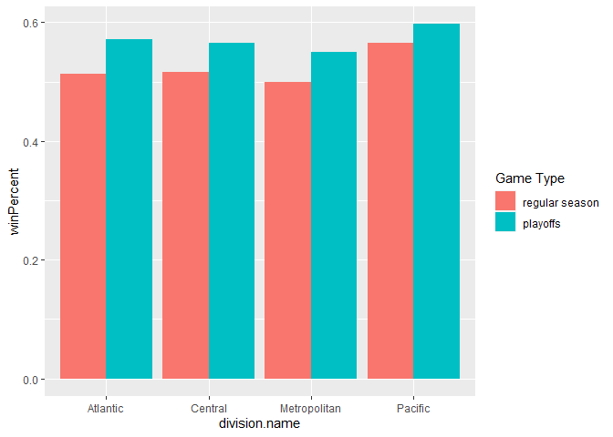

Vignette
================

  - [Required Packages](#required-packages)
  - [Functions](#functions)
      - [NHL records API](#nhl-records-api)
      - [NHL stats API](#nhl-stats-api)
  - [A wrapper function for all the functions
    above](#a-wrapper-function-for-all-the-functions-above)
  - [Exploratory Data Analysis](#exploratory-data-analysis)

In this vignette, we want to show how to access APIs to retrieve data.
We use two NHL repositories as examples: [NHL
records](https://gitlab.com/dword4/nhlapi/-/tree/master) and [NHL
stats](https://gitlab.com/dword4/nhlapi/-/blob/master/stats-api.md).

## Required Packages

To be able to access data from APIs, you should install and load the
`httr`, `jsonlite`, and `tidyverse` packages.

    ```r
    library(httr)
    library(jsonlite)
    library(tidyverse)
    ```

## Functions

### NHL records API

``` r
baseurl_records <- "https://records.nhl.com/site/api"
```

Here is a function to get basic information about all teams.  
/franchise (Returns id, firstSeasonId and lastSeasonId and name of every
team in the history of the NHL)

``` r
getFran <- function(){
  fullurl <- paste0(baseurl_records, "/", "franchise")
  fran <- GET(fullurl) %>% content("text") %>% fromJSON(flatten = TRUE)
  return(fran$data)
}
getFran() %>% head()
```

    ## No encoding supplied: defaulting to UTF-8.

    ##   id firstSeasonId lastSeasonId mostRecentTeamId
    ## 1  1      19171918           NA                8
    ## 2  2      19171918     19171918               41
    ## 3  3      19171918     19341935               45
    ## 4  4      19191920     19241925               37
    ## 5  5      19171918           NA               10
    ## 6  6      19241925           NA                6
    ##   teamCommonName teamPlaceName
    ## 1      Canadiens      Montréal
    ## 2      Wanderers      Montreal
    ## 3         Eagles     St. Louis
    ## 4         Tigers      Hamilton
    ## 5    Maple Leafs       Toronto
    ## 6         Bruins        Boston

This is a function to retrieve stats about all teams.  
/franchise-team-totals (Returns Total stats for every franchise (ex
roadTies, roadWins, etc))

``` r
getFranTeamTot <- function() {
  fullurl <- paste0(baseurl_records, "/", "franchise-team-totals")
  franTeamTot <- GET(fullurl) %>% content("text") %>% fromJSON(flatten = TRUE)
  return(franTeamTot$data)
}
getFranTeamTot() %>% head()
```

    ## No encoding supplied: defaulting to UTF-8.

    ##   id activeFranchise firstSeasonId franchiseId gameTypeId
    ## 1  1               1      19821983          23          2
    ## 2  2               1      19821983          23          3
    ## 3  3               1      19721973          22          2
    ## 4  4               1      19721973          22          3
    ## 5  5               1      19261927          10          2
    ## 6  6               1      19261927          10          3
    ##   gamesPlayed goalsAgainst goalsFor homeLosses
    ## 1        2937         8708     8647        507
    ## 2         257          634      697         53
    ## 3        3732        11779    11889        674
    ## 4         290          847      926         48
    ## 5        6504        19863    19864       1132
    ## 6         518         1447     1404        104
    ##   homeOvertimeLosses homeTies homeWins lastSeasonId losses
    ## 1                 82       96      783           NA   1181
    ## 2                  0       NA       74           NA    120
    ## 3                 81      170      942           NA   1570
    ## 4                  1       NA       89           NA    131
    ## 5                 73      448     1600           NA   2693
    ## 6                  0        1      137           NA    266
    ##   overtimeLosses penaltyMinutes pointPctg points roadLosses
    ## 1            162          44397    0.5330   3131        674
    ## 2              0           4266    0.0039      2         67
    ## 3            159          57422    0.5115   3818        896
    ## 4              0           5511    0.0138      8         83
    ## 5            147          85564    0.5125   6667       1561
    ## 6              0           8181    0.0000      0        162
    ##   roadOvertimeLosses roadTies roadWins shootoutLosses
    ## 1                 80      123      592             79
    ## 2                  0       NA       63              0
    ## 3                 78      177      714             67
    ## 4                  0       NA       70              0
    ## 5                 74      360     1256             66
    ## 6                  0        7      107              0
    ##   shootoutWins shutouts teamId           teamName ties
    ## 1           78      193      1  New Jersey Devils  219
    ## 2            0       25      1  New Jersey Devils   NA
    ## 3           82      167      2 New York Islanders  347
    ## 4            0       12      2 New York Islanders   NA
    ## 5           78      403      3   New York Rangers  808
    ## 6            0       44      3   New York Rangers    8
    ##   triCode wins
    ## 1     NJD 1375
    ## 2     NJD  137
    ## 3     NYI 1656
    ## 4     NYI  159
    ## 5     NYR 2856
    ## 6     NYR  244

To allow for convenient access of team information in the following
function, we first construct a subset of data, so users can use team
names or franchise ID to look up information.

``` r
index <- getFranTeamTot() %>% select(c("franchiseId", "teamName")) %>% unique()
```

    ## No encoding supplied: defaulting to UTF-8.

This function retrieves season records from one specific team, and
therefore you need to provide the `franchiseId` or `teamName` as an
argument. The ID can be found using `getFran` or `getFranTeamTot`.  
/site/api/franchise-season-records?cayenneExp=franchiseId=ID (Drill-down
into season records for a specific franchise)

``` r
getFranSeaRec <- function(team) {
  if (is.character(team)) {
    id <- index$franchiseId[index$teamName == team]
  } else if (is.numeric(team)){
    id <- team
  }
  fullurl <- paste0(baseurl_records, "/", "franchise-season-records?cayenneExp=franchiseId=", id)
  franSeaRec <- GET(fullurl) %>% content("text") %>% fromJSON(flatten = TRUE)
  return(franSeaRec$data)
}
getFranSeaRec(20) %>% head()
```

    ## No encoding supplied: defaulting to UTF-8.

    ##   id fewestGoals fewestGoalsAgainst
    ## 1 23         182                185
    ##   fewestGoalsAgainstSeasons fewestGoalsSeasons fewestLosses
    ## 1              2010-11 (82)       2016-17 (82)           19
    ##   fewestLossesSeasons fewestPoints fewestPointsSeasons
    ## 1        2010-11 (82)           48        1971-72 (78)
    ##   fewestTies fewestTiesSeasons fewestWins
    ## 1          3      1993-94 (84)         20
    ##            fewestWinsSeasons franchiseId     franchiseName
    ## 1 1971-72 (78), 1977-78 (80)          20 Vancouver Canucks
    ##   homeLossStreak       homeLossStreakDates homePointStreak
    ## 1              7 Mar 11 2017 - Apr 08 2017              18
    ##        homePointStreakDates homeWinStreak
    ## 1 Nov 04 1992 - Jan 16 1993            11
    ##          homeWinStreakDates homeWinlessStreak
    ## 1 Feb 03 2009 - Mar 19 2009                12
    ##      homeWinlessStreakDates lossStreak
    ## 1 Feb 19 2017 - Apr 08 2017         10
    ##             lossStreakDates mostGameGoals
    ## 1 Oct 23 1997 - Nov 11 1997            11
    ##                                                                         mostGameGoalsDates
    ## 1 Mar 28 1971 - CGS 5 @ VAN 11, Nov 25 1986 - LAK 5 @ VAN 11, Mar 01 1992 - CGY 0 @ VAN 11
    ##   mostGoals mostGoalsAgainst mostGoalsAgainstSeasons
    ## 1       346              401            1984-85 (80)
    ##   mostGoalsSeasons mostLosses mostLossesSeasons
    ## 1     1992-93 (84)         50      1971-72 (78)
    ##   mostPenaltyMinutes mostPenaltyMinutesSeasons mostPoints
    ## 1               2326              1992-93 (84)        117
    ##   mostPointsSeasons mostShutouts mostShutoutsSeasons
    ## 1      2010-11 (82)           10        2008-09 (82)
    ##   mostTies mostTiesSeasons mostWins mostWinsSeasons
    ## 1       20    1980-81 (80)       54    2010-11 (82)
    ##   pointStreak          pointStreakDates roadLossStreak
    ## 1          17 Dec 08 2010 - Jan 11 2011             12
    ##         roadLossStreakDates roadPointStreak
    ## 1 Nov 28 1981 - Feb 06 1982              10
    ##        roadPointStreakDates roadWinStreak
    ## 1 Dec 01 2010 - Jan 11 2011             9
    ##          roadWinStreakDates roadWinlessStreak
    ## 1 Mar 05 2011 - Mar 29 2011                20
    ##      roadWinlessStreakDates winStreak
    ## 1 Jan 02 1986 - Apr 02 1986        10
    ##              winStreakDates winlessStreak
    ## 1 Nov 09 2002 - Nov 30 2002            NA
    ##   winlessStreakDates
    ## 1                 NA

``` r
getFranSeaRec("Vancouver Canucks") %>% head()
```

    ## No encoding supplied: defaulting to UTF-8.

    ##   id fewestGoals fewestGoalsAgainst
    ## 1 23         182                185
    ##   fewestGoalsAgainstSeasons fewestGoalsSeasons fewestLosses
    ## 1              2010-11 (82)       2016-17 (82)           19
    ##   fewestLossesSeasons fewestPoints fewestPointsSeasons
    ## 1        2010-11 (82)           48        1971-72 (78)
    ##   fewestTies fewestTiesSeasons fewestWins
    ## 1          3      1993-94 (84)         20
    ##            fewestWinsSeasons franchiseId     franchiseName
    ## 1 1971-72 (78), 1977-78 (80)          20 Vancouver Canucks
    ##   homeLossStreak       homeLossStreakDates homePointStreak
    ## 1              7 Mar 11 2017 - Apr 08 2017              18
    ##        homePointStreakDates homeWinStreak
    ## 1 Nov 04 1992 - Jan 16 1993            11
    ##          homeWinStreakDates homeWinlessStreak
    ## 1 Feb 03 2009 - Mar 19 2009                12
    ##      homeWinlessStreakDates lossStreak
    ## 1 Feb 19 2017 - Apr 08 2017         10
    ##             lossStreakDates mostGameGoals
    ## 1 Oct 23 1997 - Nov 11 1997            11
    ##                                                                         mostGameGoalsDates
    ## 1 Mar 28 1971 - CGS 5 @ VAN 11, Nov 25 1986 - LAK 5 @ VAN 11, Mar 01 1992 - CGY 0 @ VAN 11
    ##   mostGoals mostGoalsAgainst mostGoalsAgainstSeasons
    ## 1       346              401            1984-85 (80)
    ##   mostGoalsSeasons mostLosses mostLossesSeasons
    ## 1     1992-93 (84)         50      1971-72 (78)
    ##   mostPenaltyMinutes mostPenaltyMinutesSeasons mostPoints
    ## 1               2326              1992-93 (84)        117
    ##   mostPointsSeasons mostShutouts mostShutoutsSeasons
    ## 1      2010-11 (82)           10        2008-09 (82)
    ##   mostTies mostTiesSeasons mostWins mostWinsSeasons
    ## 1       20    1980-81 (80)       54    2010-11 (82)
    ##   pointStreak          pointStreakDates roadLossStreak
    ## 1          17 Dec 08 2010 - Jan 11 2011             12
    ##         roadLossStreakDates roadPointStreak
    ## 1 Nov 28 1981 - Feb 06 1982              10
    ##        roadPointStreakDates roadWinStreak
    ## 1 Dec 01 2010 - Jan 11 2011             9
    ##          roadWinStreakDates roadWinlessStreak
    ## 1 Mar 05 2011 - Mar 29 2011                20
    ##      roadWinlessStreakDates winStreak
    ## 1 Jan 02 1986 - Apr 02 1986        10
    ##              winStreakDates winlessStreak
    ## 1 Nov 09 2002 - Nov 30 2002            NA
    ##   winlessStreakDates
    ## 1                 NA

This function retrieves goalie records, and again a `franchiseId` or
`teamName` is required.  
/franchise-goalie-records?cayenneExp=franchiseId=ID (Goalie records for
the specified franchise)

``` r
getFranGoaRec <- function(team) {
  if (is.character(team)) {
    id <- index$franchiseId[index$teamName == team]
  } else if (is.numeric(team)){
    id <- team
  }
  fullurl <- paste0(baseurl_records, "/", "franchise-goalie-records?cayenneExp=franchiseId=", id)
  franGoaRec <- GET(fullurl) %>% content("text") %>% fromJSON(flatten = TRUE)
  return(franGoaRec$data)
}
getFranGoaRec(20) %>% head()
```

    ## No encoding supplied: defaulting to UTF-8.

    ##    id activePlayer firstName franchiseId     franchiseName
    ## 1 243        FALSE      Kirk          20 Vancouver Canucks
    ## 2 297        FALSE   Roberto          20 Vancouver Canucks
    ## 3 304        FALSE   Richard          20 Vancouver Canucks
    ## 4 364        FALSE      Gary          20 Vancouver Canucks
    ## 5 367        FALSE      Sean          20 Vancouver Canucks
    ## 6 373        FALSE   Jacques          20 Vancouver Canucks
    ##   gameTypeId gamesPlayed lastName losses
    ## 1          2         516   McLean    228
    ## 2          2         448   Luongo    137
    ## 3          2         377  Brodeur    173
    ## 4          2          73  Bromley     27
    ## 5          2          16    Burke      9
    ## 6          2          10    Caron      5
    ##                mostGoalsAgainstDates
    ## 1                         1996-10-19
    ## 2             2013-02-24, 2010-04-01
    ## 3                         1981-10-17
    ## 4             1981-02-20, 1979-03-08
    ## 5 1998-01-28, 1998-01-21, 1998-01-15
    ## 6                         1973-12-20
    ##   mostGoalsAgainstOneGame         mostSavesDates
    ## 1                       9 1997-04-05, 1987-12-17
    ## 2                       8             2010-03-20
    ## 3                      10             1985-02-10
    ## 4                       9             1979-03-15
    ## 5                       6             1998-01-26
    ## 6                       9             1973-11-27
    ##   mostSavesOneGame  mostShotsAgainstDates
    ## 1               48             1988-11-17
    ## 2               50             2010-03-20
    ## 3               51             1985-02-10
    ## 4               41             1979-03-15
    ## 5               33 1998-01-28, 1998-01-26
    ## 6               33             1973-12-20
    ##   mostShotsAgainstOneGame mostShutoutsOneSeason
    ## 1                      52                     5
    ## 2                      54                     9
    ## 3                      54                     2
    ## 4                      45                     2
    ## 5                      36                     0
    ## 6                      39                     0
    ##   mostShutoutsSeasonIds mostWinsOneSeason mostWinsSeasonIds
    ## 1              19911992                38          19911992
    ## 2              20082009                47          20062007
    ## 3    19811982, 19851986                21          19821983
    ## 4              19781979                11          19781979
    ## 5              19971998                 2          19971998
    ## 6              19731974                 2          19731974
    ##   overtimeLosses playerId positionCode rookieGamesPlayed
    ## 1             NA  8449474            G                41
    ## 2             50  8466141            G                NA
    ## 3             NA  8445694            G                NA
    ## 4             NA  8445695            G                NA
    ## 5             NA  8445769            G                NA
    ## 6             NA  8445966            G                NA
    ##   rookieShutouts rookieWins seasons shutouts ties wins
    ## 1              1         11      11       20   62  211
    ## 2             NA         NA       8       38   NA  252
    ## 3             NA         NA       8        6   62  126
    ## 4             NA         NA       3        3   14   25
    ## 5             NA         NA       1        0    4    2
    ## 6             NA         NA       1        0    1    2

``` r
getFranGoaRec("Vancouver Canucks") %>% head()
```

    ## No encoding supplied: defaulting to UTF-8.

    ##    id activePlayer firstName franchiseId     franchiseName
    ## 1 243        FALSE      Kirk          20 Vancouver Canucks
    ## 2 297        FALSE   Roberto          20 Vancouver Canucks
    ## 3 304        FALSE   Richard          20 Vancouver Canucks
    ## 4 364        FALSE      Gary          20 Vancouver Canucks
    ## 5 367        FALSE      Sean          20 Vancouver Canucks
    ## 6 373        FALSE   Jacques          20 Vancouver Canucks
    ##   gameTypeId gamesPlayed lastName losses
    ## 1          2         516   McLean    228
    ## 2          2         448   Luongo    137
    ## 3          2         377  Brodeur    173
    ## 4          2          73  Bromley     27
    ## 5          2          16    Burke      9
    ## 6          2          10    Caron      5
    ##                mostGoalsAgainstDates
    ## 1                         1996-10-19
    ## 2             2013-02-24, 2010-04-01
    ## 3                         1981-10-17
    ## 4             1981-02-20, 1979-03-08
    ## 5 1998-01-28, 1998-01-21, 1998-01-15
    ## 6                         1973-12-20
    ##   mostGoalsAgainstOneGame         mostSavesDates
    ## 1                       9 1997-04-05, 1987-12-17
    ## 2                       8             2010-03-20
    ## 3                      10             1985-02-10
    ## 4                       9             1979-03-15
    ## 5                       6             1998-01-26
    ## 6                       9             1973-11-27
    ##   mostSavesOneGame  mostShotsAgainstDates
    ## 1               48             1988-11-17
    ## 2               50             2010-03-20
    ## 3               51             1985-02-10
    ## 4               41             1979-03-15
    ## 5               33 1998-01-28, 1998-01-26
    ## 6               33             1973-12-20
    ##   mostShotsAgainstOneGame mostShutoutsOneSeason
    ## 1                      52                     5
    ## 2                      54                     9
    ## 3                      54                     2
    ## 4                      45                     2
    ## 5                      36                     0
    ## 6                      39                     0
    ##   mostShutoutsSeasonIds mostWinsOneSeason mostWinsSeasonIds
    ## 1              19911992                38          19911992
    ## 2              20082009                47          20062007
    ## 3    19811982, 19851986                21          19821983
    ## 4              19781979                11          19781979
    ## 5              19971998                 2          19971998
    ## 6              19731974                 2          19731974
    ##   overtimeLosses playerId positionCode rookieGamesPlayed
    ## 1             NA  8449474            G                41
    ## 2             50  8466141            G                NA
    ## 3             NA  8445694            G                NA
    ## 4             NA  8445695            G                NA
    ## 5             NA  8445769            G                NA
    ## 6             NA  8445966            G                NA
    ##   rookieShutouts rookieWins seasons shutouts ties wins
    ## 1              1         11      11       20   62  211
    ## 2             NA         NA       8       38   NA  252
    ## 3             NA         NA       8        6   62  126
    ## 4             NA         NA       3        3   14   25
    ## 5             NA         NA       1        0    4    2
    ## 6             NA         NA       1        0    1    2

This function retrieves information about skater records, and a
`franchiseId` or `teamName` is required.  
/franchise-skater-records?cayenneExp=franchiseId=ID (Skater records,
same interaction as goalie endpoint)

``` r
getFranSkaRec <- function(team) {
  if (is.character(team)) {
    id <- index$franchiseId[index$teamName == team]
  } else if (is.numeric(team)){
    id <- team
  }
  fullurl <- paste0(baseurl_records, "/", "franchise-skater-records?cayenneExp=franchiseId=", id)
  franSkaRec <- GET(fullurl) %>% content("text") %>% fromJSON(flatten = TRUE)
  return(franSkaRec$data)
}
getFranSkaRec(20) %>% head()
```

    ## No encoding supplied: defaulting to UTF-8.

    ##      id activePlayer assists firstName franchiseId
    ## 1 16941        FALSE     648    Daniel          20
    ## 2 16942        FALSE     830    Henrik          20
    ## 3 17026        FALSE      52      Gino          20
    ## 4 17057        FALSE     224     Pavel          20
    ## 5 17115        FALSE      53    Donald          20
    ## 6 17141        FALSE     410    Markus          20
    ##       franchiseName gameTypeId gamesPlayed goals lastName
    ## 1 Vancouver Canucks          2        1306   393    Sedin
    ## 2 Vancouver Canucks          2        1330   240    Sedin
    ## 3 Vancouver Canucks          2         444    46   Odjick
    ## 4 Vancouver Canucks          2         428   254     Bure
    ## 5 Vancouver Canucks          2         388    50 Brashear
    ## 6 Vancouver Canucks          2         884   346  Naslund
    ##                                                                                                                                                                                                     mostAssistsGameDates
    ## 1 2006-02-03, 2006-10-25, 2007-01-13, 2008-03-06, 2008-10-09, 2009-10-07, 2010-01-05, 2010-03-03, 2011-03-08, 2011-12-19, 2012-02-18, 2013-04-06, 2014-10-11, 2014-11-19, 2015-01-03, 2015-11-10, 2016-02-21, 2017-12-15
    ## 2                                                                                                                                                             2007-02-06, 2010-04-10, 2012-02-18, 2015-11-21, 2016-02-21
    ## 3                                                                                                                                                                                     1992-10-16, 1992-12-29, 1993-10-23
    ## 4                                                                                                                                                                                     1992-12-18, 1995-04-22, 1997-02-06
    ## 5                                                                                                                                                                                                             2000-12-08
    ## 6                                                                                                                                                                                                             2003-02-25
    ##   mostAssistsOneGame mostAssistsOneSeason
    ## 1                  3                   63
    ## 2                  4                   83
    ## 3                  2                   13
    ## 4                  4                   50
    ## 5                  3                   19
    ## 6                  5                   56
    ##   mostAssistsSeasonIds                 mostGoalsGameDates
    ## 1             20102011                         2004-02-24
    ## 2             20092010                         2009-11-14
    ## 3   19921993, 19931994 1992-11-23, 1993-10-11, 1993-11-16
    ## 4             19921993                         1992-10-12
    ## 5             20002001                         1997-04-12
    ## 6             20022003             2002-12-14, 2003-12-09
    ##   mostGoalsOneGame mostGoalsOneSeason mostGoalsSeasonIds
    ## 1                4                 41           20102011
    ## 2                3                 29           20092010
    ## 3                2                 16           19931994
    ## 4                4                 60 19921993, 19931994
    ## 5                2                 11           19992000
    ## 6                4                 48           20022003
    ##   mostPenaltyMinutesOneSeason mostPenaltyMinutesSeasonIds
    ## 1                          50                    20072008
    ## 2                          66                    20062007
    ## 3                         371                    19961997
    ## 4                          86                    19931994
    ## 5                         372                    19971998
    ## 6                          74                    19981999
    ##      mostPointsGameDates mostPointsOneGame
    ## 1             2007-02-06                 5
    ## 2             2015-11-21                 5
    ## 3 1992-11-23, 1993-10-23                 3
    ## 4 1992-10-12, 1996-12-15                 5
    ## 5             2000-12-08                 3
    ## 6             2003-02-25                 6
    ##   mostPointsOneSeason mostPointsSeasonIds penaltyMinutes
    ## 1                 104            20102011            546
    ## 2                 112            20092010            680
    ## 3                  29            19931994           2127
    ## 4                 110            19921993            328
    ## 5                  28            20002001           1159
    ## 6                 104            20022003            614
    ##   playerId points positionCode rookiePoints seasons
    ## 1  8467875   1041            L           34      17
    ## 2  8467876   1070            C           29      17
    ## 3  8449961     98            L            8       8
    ## 4  8455738    478            R           60       7
    ## 5  8459246    103            L           NA       6
    ## 6  8458530    756            L           NA      12

``` r
getFranSkaRec("Vancouver Canucks") %>% head()
```

    ## No encoding supplied: defaulting to UTF-8.

    ##      id activePlayer assists firstName franchiseId
    ## 1 16941        FALSE     648    Daniel          20
    ## 2 16942        FALSE     830    Henrik          20
    ## 3 17026        FALSE      52      Gino          20
    ## 4 17057        FALSE     224     Pavel          20
    ## 5 17115        FALSE      53    Donald          20
    ## 6 17141        FALSE     410    Markus          20
    ##       franchiseName gameTypeId gamesPlayed goals lastName
    ## 1 Vancouver Canucks          2        1306   393    Sedin
    ## 2 Vancouver Canucks          2        1330   240    Sedin
    ## 3 Vancouver Canucks          2         444    46   Odjick
    ## 4 Vancouver Canucks          2         428   254     Bure
    ## 5 Vancouver Canucks          2         388    50 Brashear
    ## 6 Vancouver Canucks          2         884   346  Naslund
    ##                                                                                                                                                                                                     mostAssistsGameDates
    ## 1 2006-02-03, 2006-10-25, 2007-01-13, 2008-03-06, 2008-10-09, 2009-10-07, 2010-01-05, 2010-03-03, 2011-03-08, 2011-12-19, 2012-02-18, 2013-04-06, 2014-10-11, 2014-11-19, 2015-01-03, 2015-11-10, 2016-02-21, 2017-12-15
    ## 2                                                                                                                                                             2007-02-06, 2010-04-10, 2012-02-18, 2015-11-21, 2016-02-21
    ## 3                                                                                                                                                                                     1992-10-16, 1992-12-29, 1993-10-23
    ## 4                                                                                                                                                                                     1992-12-18, 1995-04-22, 1997-02-06
    ## 5                                                                                                                                                                                                             2000-12-08
    ## 6                                                                                                                                                                                                             2003-02-25
    ##   mostAssistsOneGame mostAssistsOneSeason
    ## 1                  3                   63
    ## 2                  4                   83
    ## 3                  2                   13
    ## 4                  4                   50
    ## 5                  3                   19
    ## 6                  5                   56
    ##   mostAssistsSeasonIds                 mostGoalsGameDates
    ## 1             20102011                         2004-02-24
    ## 2             20092010                         2009-11-14
    ## 3   19921993, 19931994 1992-11-23, 1993-10-11, 1993-11-16
    ## 4             19921993                         1992-10-12
    ## 5             20002001                         1997-04-12
    ## 6             20022003             2002-12-14, 2003-12-09
    ##   mostGoalsOneGame mostGoalsOneSeason mostGoalsSeasonIds
    ## 1                4                 41           20102011
    ## 2                3                 29           20092010
    ## 3                2                 16           19931994
    ## 4                4                 60 19921993, 19931994
    ## 5                2                 11           19992000
    ## 6                4                 48           20022003
    ##   mostPenaltyMinutesOneSeason mostPenaltyMinutesSeasonIds
    ## 1                          50                    20072008
    ## 2                          66                    20062007
    ## 3                         371                    19961997
    ## 4                          86                    19931994
    ## 5                         372                    19971998
    ## 6                          74                    19981999
    ##      mostPointsGameDates mostPointsOneGame
    ## 1             2007-02-06                 5
    ## 2             2015-11-21                 5
    ## 3 1992-11-23, 1993-10-23                 3
    ## 4 1992-10-12, 1996-12-15                 5
    ## 5             2000-12-08                 3
    ## 6             2003-02-25                 6
    ##   mostPointsOneSeason mostPointsSeasonIds penaltyMinutes
    ## 1                 104            20102011            546
    ## 2                 112            20092010            680
    ## 3                  29            19931994           2127
    ## 4                 110            19921993            328
    ## 5                  28            20002001           1159
    ## 6                 104            20022003            614
    ##   playerId points positionCode rookiePoints seasons
    ## 1  8467875   1041            L           34      17
    ## 2  8467876   1070            C           29      17
    ## 3  8449961     98            L            8       8
    ## 4  8455738    478            R           60       7
    ## 5  8459246    103            L           NA       6
    ## 6  8458530    756            L           NA      12

### NHL stats API

For this function, eight modifiers can be chosen, and thus an argument
(`expand`, `teamID`, or `stats`) has to be provided. Below are the eight
modifiers:

  - ?expand=team.roster Shows roster of active players for the specified
    team  
  - ?expand=person.names Same as above, but gives less info.  
  - ?expand=team.schedule.next Returns details of the upcoming game for
    a team  
  - ?expand=team.schedule.previous Same as above but for the last game
    played  
  - ?expand=team.stats Returns the teams stats for the season  
  - ?expand=team.roster\&season=20142015 Adding the season identifier
    shows the roster for that season  
  - ?teamId=4,5,29 Can string team id together to get multiple teams  
  - ?stats=statsSingleSeasonPlayoffs Specify which stats to get. Not
    fully sure all of the values

Examples of arguments:

  - `expand = "person.names"`  
  - `teamId = "4, 5, 29"`  
  - `stats = "statsSingleSeasonPlayoffs"`

For more information about these modifiers, see [the
documentation](https://gitlab.com/dword4/nhlapi/-/blob/master/stats-api.md).

``` r
baseurl_stats <- "https://statsapi.web.nhl.com/api/v1/teams"
getStats <- function(expand = "", teamID = "", stats = ""){
  if (teamID!=""){
    if (length(teamID)==1){
      baseurl_stats <- paste0("https://statsapi.web.nhl.com/api/v1/teams/", teamID)
    }
    else{
      fullurl <- paste0("https://statsapi.web.nhl.com/api/v1/teams?teamID=", teamID)
    }
  }
  if (expand != ""){
    fullurl <- paste0(baseurl_stats, "?expand=", expand)
  } else if (stats != ""){
    fullurl <- paste0(baseurl_stats, "?stats=", stats)
  }
  stats <- GET(fullurl) %>% content("text") %>% fromJSON(flatten = TRUE)
  if (expand == "team.roster"){
    stats <- stats$teams$roster.roster
  } else if (expand == "team.schedule.next"){
    stats <- stats$teams$nextGameSchedule.dates
  } else if (expand == "team.schedule.previous"){
    stats <- stats$teams$previousGameSchedule.dates
  } else if (expand == "team.stats"){
    stats <- stats$teams$teamStats
  }
  return(stats)
}
# it seems that we need to go into one more level to get person and roster info
getStats(teamID = 20, expand = "team.stats")
```

    ## [[1]]
    ##                                                                                                                                                                                                                                                                                                                                                                                                                                  splits
    ## 1 70, NA, 36, 15th, 27, 17th, 7, 21st, 79, 16th, 56.4, 18th, 2.914, 20th, 3.057, 16th, 0.9178, 24th, 21.2, 12th, 41, 19th, 35, 8th, 193, 24th, 82.1, 8th, 31.6, 15th, 32.4429, 24th, 0.667, 26th, 0.4, 3rd, 0.857, 5th, 0.852, 17th, 0.5, 12th, 0.485, 12th, 4120, 5th, 2022, 15th, 2098, 26th, 49.1, 22nd, 9.2, NA, 0.906, NA, NA, 9th, NA, 13th, NA, 20th, 20, 20, Calgary Flames, Calgary Flames, /api/v1/teams/20, /api/v1/teams/20
    ##    type.displayName type.gameType.id
    ## 1 statsSingleSeason                R
    ##   type.gameType.description type.gameType.postseason
    ## 1            Regular season                    FALSE

``` r
# getStats(expand = "team.roster&season=20142015") %>% head()
getStats(teamID = 53, expand = "team.roster")
```

    ## [[1]]
    ##    jerseyNumber person.id      person.fullName
    ## 1            15   8470755      Brad Richardson
    ## 2            34   8471262       Carl Soderberg
    ## 3            33   8471274       Alex Goligoski
    ## 4             4   8471769   Niklas Hjalmarsson
    ## 5            40   8473546      Michael Grabner
    ## 6            81   8473548          Phil Kessel
    ## 7            55   8474218         Jason Demers
    ## 8            21   8474613         Derek Stepan
    ## 9            23   8475171 Oliver Ekman-Larsson
    ## 10           35   8475311        Darcy Kuemper
    ## 11           91   8475791          Taylor Hall
    ## 12           13   8476994    Vinnie Hinostroza
    ## 13           32   8477293         Antti Raanta
    ## 14           82   8477851      Jordan Oesterle
    ## 15            8   8477951        Nick Schmaltz
    ## 16           18   8477989     Christian Dvorak
    ## 17           36   8478432    Christian Fischer
    ## 18           67   8478474        Lawson Crouse
    ## 19           83   8478856        Conor Garland
    ## 20            9   8479343       Clayton Keller
    ## 21            6   8479345       Jakob Chychrun
    ## 22           29   8480849       Barrett Hayton
    ## 23           46   8480950      Ilya Lyubushkin
    ##               person.link position.code position.name
    ## 1  /api/v1/people/8470755             C        Center
    ## 2  /api/v1/people/8471262             C        Center
    ## 3  /api/v1/people/8471274             D    Defenseman
    ## 4  /api/v1/people/8471769             D    Defenseman
    ## 5  /api/v1/people/8473546             L     Left Wing
    ## 6  /api/v1/people/8473548             R    Right Wing
    ## 7  /api/v1/people/8474218             D    Defenseman
    ## 8  /api/v1/people/8474613             C        Center
    ## 9  /api/v1/people/8475171             D    Defenseman
    ## 10 /api/v1/people/8475311             G        Goalie
    ## 11 /api/v1/people/8475791             L     Left Wing
    ## 12 /api/v1/people/8476994             R    Right Wing
    ## 13 /api/v1/people/8477293             G        Goalie
    ## 14 /api/v1/people/8477851             D    Defenseman
    ## 15 /api/v1/people/8477951             C        Center
    ## 16 /api/v1/people/8477989             C        Center
    ## 17 /api/v1/people/8478432             R    Right Wing
    ## 18 /api/v1/people/8478474             L     Left Wing
    ## 19 /api/v1/people/8478856             R    Right Wing
    ## 20 /api/v1/people/8479343             R    Right Wing
    ## 21 /api/v1/people/8479345             D    Defenseman
    ## 22 /api/v1/people/8480849             C        Center
    ## 23 /api/v1/people/8480950             D    Defenseman
    ##    position.type position.abbreviation
    ## 1        Forward                     C
    ## 2        Forward                     C
    ## 3     Defenseman                     D
    ## 4     Defenseman                     D
    ## 5        Forward                    LW
    ## 6        Forward                    RW
    ## 7     Defenseman                     D
    ## 8        Forward                     C
    ## 9     Defenseman                     D
    ## 10        Goalie                     G
    ## 11       Forward                    LW
    ## 12       Forward                    RW
    ## 13        Goalie                     G
    ## 14    Defenseman                     D
    ## 15       Forward                     C
    ## 16       Forward                     C
    ## 17       Forward                    RW
    ## 18       Forward                    LW
    ## 19       Forward                    RW
    ## 20       Forward                    RW
    ## 21    Defenseman                     D
    ## 22       Forward                     C
    ## 23    Defenseman                     D

``` r
# getStats(stats = "statsSingleSeasonPlayoffs") %>% head()
```

## A wrapper function for all the functions above

Endpoints:

  - franchise (getFran)  
  - team total (getFranTeamTot)  
  - season record (getFranSeaRec)  
  - goalie record (getFranGoaRec)  
  - skater record (getFranSkaRec)  
  - stats (getStats)
      - expand = “team.roster”  
      - expand = “person.names”  
      - expand = “team.schedule.next”  
      - expand = “team.schedule.previous”  
      - expand = “team.stats”  
      - expand = “team.roster”, season = “20142015”  
      - teamId = “4, 5, 29”  
      - stats = “statsSingleSeasonPlayoffs”

See more details in the documentation of [NHL
records](https://gitlab.com/dword4/nhlapi/-/blob/master/records-api.md)
and [NHL
stats](https://gitlab.com/dword4/nhlapi/-/blob/master/stats-api.md).

``` r
# add a 
nhlFun <- function(endpoints, ...){
  if (endpoints == "franchise") {
    getFran()
  } else if (endpoints == "team total") {
    getFranTeamTot()
  } else if (endpoints == "season record"){
    getFranSeaRec(...)
  } else if (endpoints == "goalie record"){
    getFranGoaRec(...)
  } else if (endpoints == "skater record"){
    getFranSkaRec(...)
  } else if (endpoints == "stats"){
    getStats(...)
  } else {
    stop("Please enter a valid endpoint")
  }
}
nhlFun(endpoints = "skater record", "20")
```

    ## No encoding supplied: defaulting to UTF-8.

    ## NULL

``` r
nhlFun(endpoints = "stats", expand = "person.team")
```

    ## $copyright
    ## [1] "NHL and the NHL Shield are registered trademarks of the National Hockey League. NHL and NHL team marks are the property of the NHL and its teams. © NHL 2020. All Rights Reserved."
    ## 
    ## $teams
    ##    id                  name             link abbreviation
    ## 1   1     New Jersey Devils  /api/v1/teams/1          NJD
    ## 2   2    New York Islanders  /api/v1/teams/2          NYI
    ## 3   3      New York Rangers  /api/v1/teams/3          NYR
    ## 4   4   Philadelphia Flyers  /api/v1/teams/4          PHI
    ## 5   5   Pittsburgh Penguins  /api/v1/teams/5          PIT
    ## 6   6         Boston Bruins  /api/v1/teams/6          BOS
    ## 7   7        Buffalo Sabres  /api/v1/teams/7          BUF
    ## 8   8    Montréal Canadiens  /api/v1/teams/8          MTL
    ## 9   9       Ottawa Senators  /api/v1/teams/9          OTT
    ## 10 10   Toronto Maple Leafs /api/v1/teams/10          TOR
    ## 11 12   Carolina Hurricanes /api/v1/teams/12          CAR
    ## 12 13      Florida Panthers /api/v1/teams/13          FLA
    ## 13 14   Tampa Bay Lightning /api/v1/teams/14          TBL
    ## 14 15   Washington Capitals /api/v1/teams/15          WSH
    ## 15 16    Chicago Blackhawks /api/v1/teams/16          CHI
    ## 16 17     Detroit Red Wings /api/v1/teams/17          DET
    ## 17 18   Nashville Predators /api/v1/teams/18          NSH
    ## 18 19       St. Louis Blues /api/v1/teams/19          STL
    ## 19 20        Calgary Flames /api/v1/teams/20          CGY
    ## 20 21    Colorado Avalanche /api/v1/teams/21          COL
    ## 21 22       Edmonton Oilers /api/v1/teams/22          EDM
    ## 22 23     Vancouver Canucks /api/v1/teams/23          VAN
    ## 23 24         Anaheim Ducks /api/v1/teams/24          ANA
    ## 24 25          Dallas Stars /api/v1/teams/25          DAL
    ## 25 26     Los Angeles Kings /api/v1/teams/26          LAK
    ## 26 28       San Jose Sharks /api/v1/teams/28          SJS
    ## 27 29 Columbus Blue Jackets /api/v1/teams/29          CBJ
    ## 28 30        Minnesota Wild /api/v1/teams/30          MIN
    ## 29 52         Winnipeg Jets /api/v1/teams/52          WPG
    ## 30 53       Arizona Coyotes /api/v1/teams/53          ARI
    ## 31 54  Vegas Golden Knights /api/v1/teams/54          VGK
    ##          teamName locationName firstYearOfPlay    shortName
    ## 1          Devils   New Jersey            1982   New Jersey
    ## 2       Islanders     New York            1972 NY Islanders
    ## 3         Rangers     New York            1926   NY Rangers
    ## 4          Flyers Philadelphia            1967 Philadelphia
    ## 5        Penguins   Pittsburgh            1967   Pittsburgh
    ## 6          Bruins       Boston            1924       Boston
    ## 7          Sabres      Buffalo            1970      Buffalo
    ## 8       Canadiens     Montréal            1909     Montréal
    ## 9        Senators       Ottawa            1990       Ottawa
    ## 10    Maple Leafs      Toronto            1917      Toronto
    ## 11     Hurricanes     Carolina            1979     Carolina
    ## 12       Panthers      Florida            1993      Florida
    ## 13      Lightning    Tampa Bay            1991    Tampa Bay
    ## 14       Capitals   Washington            1974   Washington
    ## 15     Blackhawks      Chicago            1926      Chicago
    ## 16      Red Wings      Detroit            1926      Detroit
    ## 17      Predators    Nashville            1997    Nashville
    ## 18          Blues    St. Louis            1967     St Louis
    ## 19         Flames      Calgary            1980      Calgary
    ## 20      Avalanche     Colorado            1979     Colorado
    ## 21         Oilers     Edmonton            1979     Edmonton
    ## 22        Canucks    Vancouver            1970    Vancouver
    ## 23          Ducks      Anaheim            1993      Anaheim
    ## 24          Stars       Dallas            1967       Dallas
    ## 25          Kings  Los Angeles            1967  Los Angeles
    ## 26         Sharks     San Jose            1990     San Jose
    ## 27   Blue Jackets     Columbus            1997     Columbus
    ## 28           Wild    Minnesota            1997    Minnesota
    ## 29           Jets     Winnipeg            2011     Winnipeg
    ## 30        Coyotes      Arizona            1979      Arizona
    ## 31 Golden Knights        Vegas            2016        Vegas
    ##                       officialSiteUrl franchiseId active
    ## 1     http://www.newjerseydevils.com/          23   TRUE
    ## 2    http://www.newyorkislanders.com/          22   TRUE
    ## 3      http://www.newyorkrangers.com/          10   TRUE
    ## 4  http://www.philadelphiaflyers.com/          16   TRUE
    ## 5      http://pittsburghpenguins.com/          17   TRUE
    ## 6        http://www.bostonbruins.com/           6   TRUE
    ## 7              http://www.sabres.com/          19   TRUE
    ## 8           http://www.canadiens.com/           1   TRUE
    ## 9      http://www.ottawasenators.com/          30   TRUE
    ## 10         http://www.mapleleafs.com/           5   TRUE
    ## 11 http://www.carolinahurricanes.com/          26   TRUE
    ## 12    http://www.floridapanthers.com/          33   TRUE
    ## 13  http://www.tampabaylightning.com/          31   TRUE
    ## 14 http://www.washingtoncapitals.com/          24   TRUE
    ## 15  http://www.chicagoblackhawks.com/          11   TRUE
    ## 16    http://www.detroitredwings.com/          12   TRUE
    ## 17 http://www.nashvillepredators.com/          34   TRUE
    ## 18       http://www.stlouisblues.com/          18   TRUE
    ## 19      http://www.calgaryflames.com/          21   TRUE
    ## 20  http://www.coloradoavalanche.com/          27   TRUE
    ## 21     http://www.edmontonoilers.com/          25   TRUE
    ## 22            http://www.canucks.com/          20   TRUE
    ## 23       http://www.anaheimducks.com/          32   TRUE
    ## 24        http://www.dallasstars.com/          15   TRUE
    ## 25            http://www.lakings.com/          14   TRUE
    ## 26           http://www.sjsharks.com/          29   TRUE
    ## 27        http://www.bluejackets.com/          36   TRUE
    ## 28               http://www.wild.com/          37   TRUE
    ## 29           http://winnipegjets.com/          35   TRUE
    ## 30     http://www.arizonacoyotes.com/          28   TRUE
    ## 31 http://www.vegasgoldenknights.com/          38   TRUE
    ##                  venue.name          venue.link
    ## 1         Prudential Center /api/v1/venues/null
    ## 2           Barclays Center /api/v1/venues/5026
    ## 3     Madison Square Garden /api/v1/venues/5054
    ## 4        Wells Fargo Center /api/v1/venues/5096
    ## 5          PPG Paints Arena /api/v1/venues/5034
    ## 6                 TD Garden /api/v1/venues/5085
    ## 7            KeyBank Center /api/v1/venues/5039
    ## 8               Bell Centre /api/v1/venues/5028
    ## 9      Canadian Tire Centre /api/v1/venues/5031
    ## 10         Scotiabank Arena /api/v1/venues/null
    ## 11                PNC Arena /api/v1/venues/5066
    ## 12              BB&T Center /api/v1/venues/5027
    ## 13             AMALIE Arena /api/v1/venues/null
    ## 14        Capital One Arena /api/v1/venues/5094
    ## 15            United Center /api/v1/venues/5092
    ## 16     Little Caesars Arena /api/v1/venues/5145
    ## 17        Bridgestone Arena /api/v1/venues/5030
    ## 18        Enterprise Center /api/v1/venues/5076
    ## 19    Scotiabank Saddledome /api/v1/venues/5075
    ## 20             Pepsi Center /api/v1/venues/5064
    ## 21             Rogers Place /api/v1/venues/5100
    ## 22             Rogers Arena /api/v1/venues/5073
    ## 23             Honda Center /api/v1/venues/5046
    ## 24 American Airlines Center /api/v1/venues/5019
    ## 25           STAPLES Center /api/v1/venues/5081
    ## 26   SAP Center at San Jose /api/v1/venues/null
    ## 27         Nationwide Arena /api/v1/venues/5059
    ## 28       Xcel Energy Center /api/v1/venues/5098
    ## 29           Bell MTS Place /api/v1/venues/5058
    ## 30         Gila River Arena /api/v1/venues/5043
    ## 31           T-Mobile Arena /api/v1/venues/5178
    ##      venue.city venue.id   venue.timeZone.id
    ## 1        Newark       NA    America/New_York
    ## 2      Brooklyn     5026    America/New_York
    ## 3      New York     5054    America/New_York
    ## 4  Philadelphia     5096    America/New_York
    ## 5    Pittsburgh     5034    America/New_York
    ## 6        Boston     5085    America/New_York
    ## 7       Buffalo     5039    America/New_York
    ## 8      Montréal     5028    America/Montreal
    ## 9        Ottawa     5031    America/New_York
    ## 10      Toronto       NA     America/Toronto
    ## 11      Raleigh     5066    America/New_York
    ## 12      Sunrise     5027    America/New_York
    ## 13        Tampa       NA    America/New_York
    ## 14   Washington     5094    America/New_York
    ## 15      Chicago     5092     America/Chicago
    ## 16      Detroit     5145     America/Detroit
    ## 17    Nashville     5030     America/Chicago
    ## 18    St. Louis     5076     America/Chicago
    ## 19      Calgary     5075      America/Denver
    ## 20       Denver     5064      America/Denver
    ## 21     Edmonton     5100    America/Edmonton
    ## 22    Vancouver     5073   America/Vancouver
    ## 23      Anaheim     5046 America/Los_Angeles
    ## 24       Dallas     5019     America/Chicago
    ## 25  Los Angeles     5081 America/Los_Angeles
    ## 26     San Jose       NA America/Los_Angeles
    ## 27     Columbus     5059    America/New_York
    ## 28     St. Paul     5098     America/Chicago
    ## 29     Winnipeg     5058    America/Winnipeg
    ## 30     Glendale     5043     America/Phoenix
    ## 31    Las Vegas     5178 America/Los_Angeles
    ##    venue.timeZone.offset venue.timeZone.tz division.id
    ## 1                     -4               EDT          18
    ## 2                     -4               EDT          18
    ## 3                     -4               EDT          18
    ## 4                     -4               EDT          18
    ## 5                     -4               EDT          18
    ## 6                     -4               EDT          17
    ## 7                     -4               EDT          17
    ## 8                     -4               EDT          17
    ## 9                     -4               EDT          17
    ## 10                    -4               EDT          17
    ## 11                    -4               EDT          18
    ## 12                    -4               EDT          17
    ## 13                    -4               EDT          17
    ## 14                    -4               EDT          18
    ## 15                    -5               CDT          16
    ## 16                    -4               EDT          17
    ## 17                    -5               CDT          16
    ## 18                    -5               CDT          16
    ## 19                    -6               MDT          15
    ## 20                    -6               MDT          16
    ## 21                    -6               MDT          15
    ## 22                    -7               PDT          15
    ## 23                    -7               PDT          15
    ## 24                    -5               CDT          16
    ## 25                    -7               PDT          15
    ## 26                    -7               PDT          15
    ## 27                    -4               EDT          18
    ## 28                    -5               CDT          16
    ## 29                    -5               CDT          16
    ## 30                    -7               MST          15
    ## 31                    -7               PDT          15
    ##    division.name division.nameShort        division.link
    ## 1   Metropolitan              Metro /api/v1/divisions/18
    ## 2   Metropolitan              Metro /api/v1/divisions/18
    ## 3   Metropolitan              Metro /api/v1/divisions/18
    ## 4   Metropolitan              Metro /api/v1/divisions/18
    ## 5   Metropolitan              Metro /api/v1/divisions/18
    ## 6       Atlantic                ATL /api/v1/divisions/17
    ## 7       Atlantic                ATL /api/v1/divisions/17
    ## 8       Atlantic                ATL /api/v1/divisions/17
    ## 9       Atlantic                ATL /api/v1/divisions/17
    ## 10      Atlantic                ATL /api/v1/divisions/17
    ## 11  Metropolitan              Metro /api/v1/divisions/18
    ## 12      Atlantic                ATL /api/v1/divisions/17
    ## 13      Atlantic                ATL /api/v1/divisions/17
    ## 14  Metropolitan              Metro /api/v1/divisions/18
    ## 15       Central                CEN /api/v1/divisions/16
    ## 16      Atlantic                ATL /api/v1/divisions/17
    ## 17       Central                CEN /api/v1/divisions/16
    ## 18       Central                CEN /api/v1/divisions/16
    ## 19       Pacific                PAC /api/v1/divisions/15
    ## 20       Central                CEN /api/v1/divisions/16
    ## 21       Pacific                PAC /api/v1/divisions/15
    ## 22       Pacific                PAC /api/v1/divisions/15
    ## 23       Pacific                PAC /api/v1/divisions/15
    ## 24       Central                CEN /api/v1/divisions/16
    ## 25       Pacific                PAC /api/v1/divisions/15
    ## 26       Pacific                PAC /api/v1/divisions/15
    ## 27  Metropolitan              Metro /api/v1/divisions/18
    ## 28       Central                CEN /api/v1/divisions/16
    ## 29       Central                CEN /api/v1/divisions/16
    ## 30       Pacific                PAC /api/v1/divisions/15
    ## 31       Pacific                PAC /api/v1/divisions/15
    ##    division.abbreviation conference.id conference.name
    ## 1                      M             6         Eastern
    ## 2                      M             6         Eastern
    ## 3                      M             6         Eastern
    ## 4                      M             6         Eastern
    ## 5                      M             6         Eastern
    ## 6                      A             6         Eastern
    ## 7                      A             6         Eastern
    ## 8                      A             6         Eastern
    ## 9                      A             6         Eastern
    ## 10                     A             6         Eastern
    ## 11                     M             6         Eastern
    ## 12                     A             6         Eastern
    ## 13                     A             6         Eastern
    ## 14                     M             6         Eastern
    ## 15                     C             5         Western
    ## 16                     A             6         Eastern
    ## 17                     C             5         Western
    ## 18                     C             5         Western
    ## 19                     P             5         Western
    ## 20                     C             5         Western
    ## 21                     P             5         Western
    ## 22                     P             5         Western
    ## 23                     P             5         Western
    ## 24                     C             5         Western
    ## 25                     P             5         Western
    ## 26                     P             5         Western
    ## 27                     M             6         Eastern
    ## 28                     C             5         Western
    ## 29                     C             5         Western
    ## 30                     P             5         Western
    ## 31                     P             5         Western
    ##          conference.link franchise.franchiseId
    ## 1  /api/v1/conferences/6                    23
    ## 2  /api/v1/conferences/6                    22
    ## 3  /api/v1/conferences/6                    10
    ## 4  /api/v1/conferences/6                    16
    ## 5  /api/v1/conferences/6                    17
    ## 6  /api/v1/conferences/6                     6
    ## 7  /api/v1/conferences/6                    19
    ## 8  /api/v1/conferences/6                     1
    ## 9  /api/v1/conferences/6                    30
    ## 10 /api/v1/conferences/6                     5
    ## 11 /api/v1/conferences/6                    26
    ## 12 /api/v1/conferences/6                    33
    ## 13 /api/v1/conferences/6                    31
    ## 14 /api/v1/conferences/6                    24
    ## 15 /api/v1/conferences/5                    11
    ## 16 /api/v1/conferences/6                    12
    ## 17 /api/v1/conferences/5                    34
    ## 18 /api/v1/conferences/5                    18
    ## 19 /api/v1/conferences/5                    21
    ## 20 /api/v1/conferences/5                    27
    ## 21 /api/v1/conferences/5                    25
    ## 22 /api/v1/conferences/5                    20
    ## 23 /api/v1/conferences/5                    32
    ## 24 /api/v1/conferences/5                    15
    ## 25 /api/v1/conferences/5                    14
    ## 26 /api/v1/conferences/5                    29
    ## 27 /api/v1/conferences/6                    36
    ## 28 /api/v1/conferences/5                    37
    ## 29 /api/v1/conferences/5                    35
    ## 30 /api/v1/conferences/5                    28
    ## 31 /api/v1/conferences/5                    38
    ##    franchise.teamName        franchise.link
    ## 1              Devils /api/v1/franchises/23
    ## 2           Islanders /api/v1/franchises/22
    ## 3             Rangers /api/v1/franchises/10
    ## 4              Flyers /api/v1/franchises/16
    ## 5            Penguins /api/v1/franchises/17
    ## 6              Bruins  /api/v1/franchises/6
    ## 7              Sabres /api/v1/franchises/19
    ## 8           Canadiens  /api/v1/franchises/1
    ## 9            Senators /api/v1/franchises/30
    ## 10        Maple Leafs  /api/v1/franchises/5
    ## 11         Hurricanes /api/v1/franchises/26
    ## 12           Panthers /api/v1/franchises/33
    ## 13          Lightning /api/v1/franchises/31
    ## 14           Capitals /api/v1/franchises/24
    ## 15         Blackhawks /api/v1/franchises/11
    ## 16          Red Wings /api/v1/franchises/12
    ## 17          Predators /api/v1/franchises/34
    ## 18              Blues /api/v1/franchises/18
    ## 19             Flames /api/v1/franchises/21
    ## 20          Avalanche /api/v1/franchises/27
    ## 21             Oilers /api/v1/franchises/25
    ## 22            Canucks /api/v1/franchises/20
    ## 23              Ducks /api/v1/franchises/32
    ## 24              Stars /api/v1/franchises/15
    ## 25              Kings /api/v1/franchises/14
    ## 26             Sharks /api/v1/franchises/29
    ## 27       Blue Jackets /api/v1/franchises/36
    ## 28               Wild /api/v1/franchises/37
    ## 29               Jets /api/v1/franchises/35
    ## 30            Coyotes /api/v1/franchises/28
    ## 31     Golden Knights /api/v1/franchises/38

``` r
# nhlFun(endpoints = "team total")
```

## Exploratory Data Analysis

``` r
# perhaps use the wrapper function here
franTot <- getFranTeamTot()
```

    ## No encoding supplied: defaulting to UTF-8.

``` r
str(franTot)
```

    ## 'data.frame':    105 obs. of  30 variables:
    ##  $ id                : int  1 2 3 4 5 6 7 8 9 10 ...
    ##  $ activeFranchise   : int  1 1 1 1 1 1 1 1 1 1 ...
    ##  $ firstSeasonId     : int  19821983 19821983 19721973 19721973 19261927 19261927 19671968 19671968 19671968 19671968 ...
    ##  $ franchiseId       : int  23 23 22 22 10 10 16 16 17 17 ...
    ##  $ gameTypeId        : int  2 3 2 3 2 3 3 2 2 3 ...
    ##  $ gamesPlayed       : int  2937 257 3732 290 6504 518 449 4115 4115 385 ...
    ##  $ goalsAgainst      : int  8708 634 11779 847 19863 1447 1332 12054 13893 1110 ...
    ##  $ goalsFor          : int  8647 697 11889 926 19864 1404 1335 13527 13678 1174 ...
    ##  $ homeLosses        : int  507 53 674 48 1132 104 97 572 679 83 ...
    ##  $ homeOvertimeLosses: int  82 0 81 1 73 0 0 89 58 0 ...
    ##  $ homeTies          : int  96 NA 170 NA 448 1 NA 193 205 NA ...
    ##  $ homeWins          : int  783 74 942 89 1600 137 135 1204 1116 112 ...
    ##  $ lastSeasonId      : int  NA NA NA NA NA NA NA NA NA NA ...
    ##  $ losses            : int  1181 120 1570 131 2693 266 218 1429 1718 178 ...
    ##  $ overtimeLosses    : int  162 0 159 0 147 0 0 175 148 0 ...
    ##  $ penaltyMinutes    : int  44397 4266 57422 5511 85564 8181 9104 75761 65826 6056 ...
    ##  $ pointPctg         : num  0.533 0.0039 0.5115 0.0138 0.5125 ...
    ##  $ points            : int  3131 2 3818 8 6667 0 4 4740 4263 12 ...
    ##  $ roadLosses        : int  674 67 896 83 1561 162 121 857 1039 95 ...
    ##  $ roadOvertimeLosses: int  80 0 78 0 74 0 0 86 90 1 ...
    ##  $ roadTies          : int  123 NA 177 NA 360 7 NA 264 178 NA ...
    ##  $ roadWins          : int  592 63 714 70 1256 107 96 850 750 95 ...
    ##  $ shootoutLosses    : int  79 0 67 0 66 0 0 88 53 0 ...
    ##  $ shootoutWins      : int  78 0 82 0 78 0 0 50 80 0 ...
    ##  $ shutouts          : int  193 25 167 12 403 44 33 245 184 30 ...
    ##  $ teamId            : int  1 1 2 2 3 3 4 4 5 5 ...
    ##  $ teamName          : chr  "New Jersey Devils" "New Jersey Devils" "New York Islanders" "New York Islanders" ...
    ##  $ ties              : int  219 NA 347 NA 808 8 NA 457 383 NA ...
    ##  $ triCode           : chr  "NJD" "NJD" "NYI" "NYI" ...
    ##  $ wins              : int  1375 137 1656 159 2856 244 231 2054 1866 207 ...

``` r
franTot <- franTot %>% select(-c("id", "activeFranchise", "firstSeasonId", "gameTypeId", "lastSeasonId"))
franStats <- getStats(expand = "person.names") 
franStats <- franStats$teams %>% select(c("locationName", "firstYearOfPlay", "franchiseId", "venue.city", "venue.timeZone.id", "venue.timeZone.tz", "division.name", "conference.name"))
combined <- full_join(franTot, franStats, by = "franchiseId") %>% mutate(winPercent = wins / gamesPlayed, homeWinPercent = homeWins / wins)
head(combined)
```

    ##   franchiseId gamesPlayed goalsAgainst goalsFor homeLosses
    ## 1          23        2937         8708     8647        507
    ## 2          23         257          634      697         53
    ## 3          22        3732        11779    11889        674
    ## 4          22         290          847      926         48
    ## 5          10        6504        19863    19864       1132
    ## 6          10         518         1447     1404        104
    ##   homeOvertimeLosses homeTies homeWins losses
    ## 1                 82       96      783   1181
    ## 2                  0       NA       74    120
    ## 3                 81      170      942   1570
    ## 4                  1       NA       89    131
    ## 5                 73      448     1600   2693
    ## 6                  0        1      137    266
    ##   overtimeLosses penaltyMinutes pointPctg points roadLosses
    ## 1            162          44397    0.5330   3131        674
    ## 2              0           4266    0.0039      2         67
    ## 3            159          57422    0.5115   3818        896
    ## 4              0           5511    0.0138      8         83
    ## 5            147          85564    0.5125   6667       1561
    ## 6              0           8181    0.0000      0        162
    ##   roadOvertimeLosses roadTies roadWins shootoutLosses
    ## 1                 80      123      592             79
    ## 2                  0       NA       63              0
    ## 3                 78      177      714             67
    ## 4                  0       NA       70              0
    ## 5                 74      360     1256             66
    ## 6                  0        7      107              0
    ##   shootoutWins shutouts teamId           teamName ties
    ## 1           78      193      1  New Jersey Devils  219
    ## 2            0       25      1  New Jersey Devils   NA
    ## 3           82      167      2 New York Islanders  347
    ## 4            0       12      2 New York Islanders   NA
    ## 5           78      403      3   New York Rangers  808
    ## 6            0       44      3   New York Rangers    8
    ##   triCode wins locationName firstYearOfPlay venue.city
    ## 1     NJD 1375   New Jersey            1982     Newark
    ## 2     NJD  137   New Jersey            1982     Newark
    ## 3     NYI 1656     New York            1972   Brooklyn
    ## 4     NYI  159     New York            1972   Brooklyn
    ## 5     NYR 2856     New York            1926   New York
    ## 6     NYR  244     New York            1926   New York
    ##   venue.timeZone.id venue.timeZone.tz division.name
    ## 1  America/New_York               EDT  Metropolitan
    ## 2  America/New_York               EDT  Metropolitan
    ## 3  America/New_York               EDT  Metropolitan
    ## 4  America/New_York               EDT  Metropolitan
    ## 5  America/New_York               EDT  Metropolitan
    ## 6  America/New_York               EDT  Metropolitan
    ##   conference.name winPercent homeWinPercent
    ## 1         Eastern  0.4681648      0.5694545
    ## 2         Eastern  0.5330739      0.5401460
    ## 3         Eastern  0.4437299      0.5688406
    ## 4         Eastern  0.5482759      0.5597484
    ## 5         Eastern  0.4391144      0.5602241
    ## 6         Eastern  0.4710425      0.5614754

``` r
ggplot(combined, aes(x = homeWins, y = homeLosses)) + geom_point(aes(color = division.name))
```

<!-- -->

``` r
ggplot(combined, aes (x = winPercent)) + geom_histogram(aes(y = ..density..))
```

    ## `stat_bin()` using `bins = 30`. Pick better value with
    ## `binwidth`.

<!-- -->
