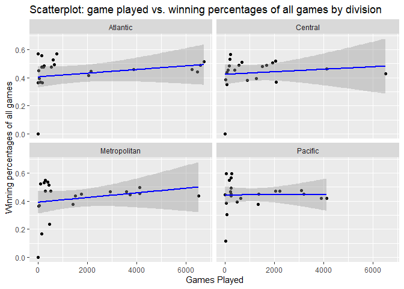
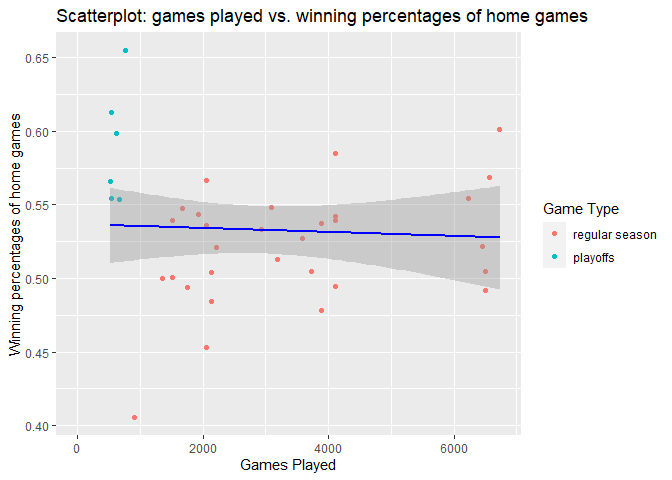
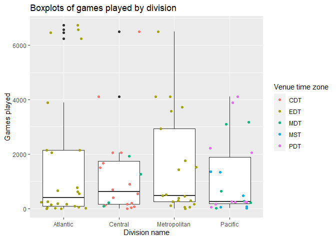
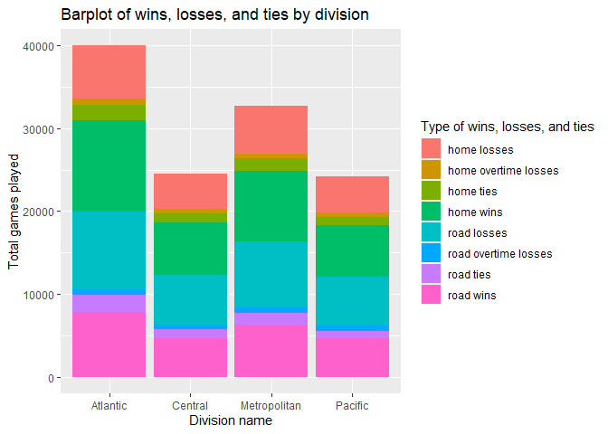
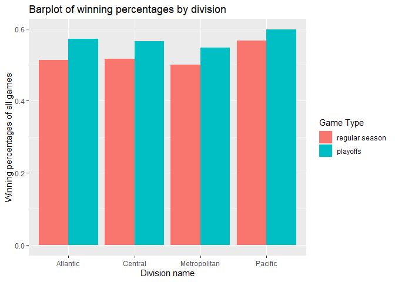
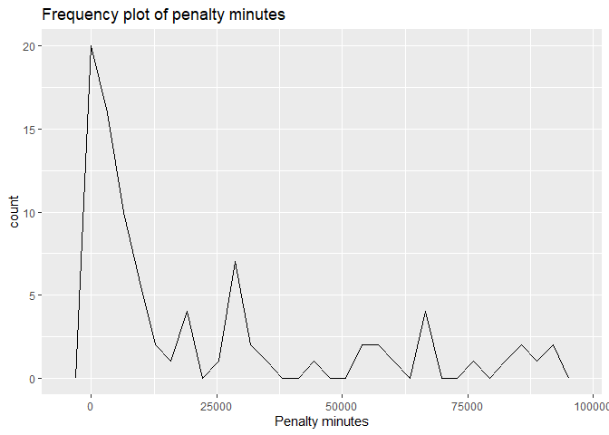

Vignette
================

  - [Required Packages](#required-packages)
  - [Functions](#functions)
      - [NHL records API](#nhl-records-api)
      - [NHL stats API](#nhl-stats-api)
      - [A wrapper function for all the functions
        above](#a-wrapper-function-for-all-the-functions-above)
  - [Exploratory Data Analysis](#exploratory-data-analysis)
      - [Retrieve Information](#retrieve-information)
      - [Summaries](#summaries)
      - [Visualize Data](#visualize-data)

This vignette demonstrates how to access APIs to retrieve data. We use
two NHL repositories as examples: [NHL
records](https://gitlab.com/dword4/nhlapi/-/tree/master) and [NHL
stats](https://gitlab.com/dword4/nhlapi/-/blob/master/stats-api.md).

## Required Packages

To be able to access data from APIs, you should install and load the
`httr`, `jsonlite`, and `tidyverse` packages.

``` r
library(httr)
library(jsonlite)
library(tidyverse)
```

## Functions

### NHL records API

``` r
baseurl_records <- "https://records.nhl.com/site/api"
```

The function `getFran` retrieves basic information (id, firstSeasonId and
lastSeasonId and name of every team in the history of the NHL) about all
teams. No arguments are needed.

``` r
getFran <- function(){
  fullurl <- paste0(baseurl_records, "/", "franchise")
  fran <- GET(fullurl) %>% content("text") %>% fromJSON(flatten = TRUE)
  return(fran$data)
}
getFran() %>% tbl_df()
```

    ## # A tibble: 38 x 6
    ##       id firstSeasonId lastSeasonId mostRecentTeamId
    ##    <int>         <int>        <int>            <int>
    ##  1     1      19171918           NA                8
    ##  2     2      19171918     19171918               41
    ##  3     3      19171918     19341935               45
    ##  4     4      19191920     19241925               37
    ##  5     5      19171918           NA               10
    ##  6     6      19241925           NA                6
    ##  7     7      19241925     19371938               43
    ##  8     8      19251926     19411942               51
    ##  9     9      19251926     19301931               39
    ## 10    10      19261927           NA                3
    ## # ... with 28 more rows, and 2 more variables:
    ## #   teamCommonName <chr>, teamPlaceName <chr>

The function `getFranTeamTot` retrieves stats about all teams (Total
stats for every franchise (ex roadTies, roadWins, etc)). No arguments
are needed.

``` r
getFranTeamTot <- function() {
  fullurl <- paste0(baseurl_records, "/", "franchise-team-totals")
  franTeamTot <- GET(fullurl) %>% content("text") %>% fromJSON(flatten = TRUE)
  return(franTeamTot$data)
}
getFranTeamTot() %>% tbl_df()
```

    ## # A tibble: 105 x 30
    ##       id activeFranchise firstSeasonId franchiseId
    ##    <int>           <int>         <int>       <int>
    ##  1     1               1      19821983          23
    ##  2     2               1      19821983          23
    ##  3     3               1      19721973          22
    ##  4     4               1      19721973          22
    ##  5     5               1      19261927          10
    ##  6     6               1      19261927          10
    ##  7     7               1      19671968          16
    ##  8     8               1      19671968          16
    ##  9     9               1      19671968          17
    ## 10    10               1      19671968          17
    ## # ... with 95 more rows, and 26 more variables:
    ## #   gameTypeId <int>, gamesPlayed <int>,
    ## #   goalsAgainst <int>, goalsFor <int>, homeLosses <int>,
    ## #   homeOvertimeLosses <int>, homeTies <int>,
    ## #   homeWins <int>, lastSeasonId <int>, losses <int>,
    ## #   overtimeLosses <int>, penaltyMinutes <int>,
    ## #   pointPctg <dbl>, points <int>, roadLosses <int>,
    ## #   roadOvertimeLosses <int>, roadTies <int>,
    ## #   roadWins <int>, shootoutLosses <int>,
    ## #   shootoutWins <int>, shutouts <int>, teamId <int>,
    ## #   teamName <chr>, ties <int>, triCode <chr>, wins <int>

To allow for convenient access of team information in the following
functions, we first construct a subset of data, so users can use team
names or franchise ID (or team names or team ID) to look up information.

``` r
index <- getFranTeamTot() %>% select(c("franchiseId", "teamName", "teamId")) %>% unique()
```

The function `getFranSeaRec` retrieves season records for a specific
franchise, and therefore the argument `franchiseId` or `teamName` is
needed. (`franchiseId` can be found using `getFran` or
`getFranTeamTot`.)

``` r
getFranSeaRec <- function(team) {
  if (is.character(team)) {
    id <- index$franchiseId[index$teamName == team]
  } else if (is.numeric(team)){
    id <- team
  }
  fullurl <- paste0(baseurl_records, "/", "franchise-season-records?cayenneExp=franchiseId=", id)
  franSeaRec <- GET(fullurl) %>% content("text") %>% fromJSON(flatten = TRUE)
  return(franSeaRec$data)
}
getFranSeaRec(20) %>% tbl_df()
```

    ## # A tibble: 1 x 57
    ##      id fewestGoals fewestGoalsAgai~ fewestGoalsAgai~
    ##   <int>       <int>            <int> <chr>           
    ## 1    23         182              185 2010-11 (82)    
    ## # ... with 53 more variables: fewestGoalsSeasons <chr>,
    ## #   fewestLosses <int>, fewestLossesSeasons <chr>,
    ## #   fewestPoints <int>, fewestPointsSeasons <chr>,
    ## #   fewestTies <int>, fewestTiesSeasons <chr>,
    ## #   fewestWins <int>, fewestWinsSeasons <chr>,
    ## #   franchiseId <int>, franchiseName <chr>,
    ## #   homeLossStreak <int>, homeLossStreakDates <chr>,
    ## #   homePointStreak <int>, homePointStreakDates <chr>,
    ## #   homeWinStreak <int>, homeWinStreakDates <chr>,
    ## #   homeWinlessStreak <int>, homeWinlessStreakDates <chr>,
    ## #   lossStreak <int>, lossStreakDates <chr>,
    ## #   mostGameGoals <int>, mostGameGoalsDates <chr>,
    ## #   mostGoals <int>, mostGoalsAgainst <int>,
    ## #   mostGoalsAgainstSeasons <chr>, mostGoalsSeasons <chr>,
    ## #   mostLosses <int>, mostLossesSeasons <chr>,
    ## #   mostPenaltyMinutes <int>,
    ## #   mostPenaltyMinutesSeasons <chr>, mostPoints <int>,
    ## #   mostPointsSeasons <chr>, mostShutouts <int>,
    ## #   mostShutoutsSeasons <chr>, mostTies <int>,
    ## #   mostTiesSeasons <chr>, mostWins <int>,
    ## #   mostWinsSeasons <chr>, pointStreak <int>,
    ## #   pointStreakDates <chr>, roadLossStreak <int>,
    ## #   roadLossStreakDates <chr>, roadPointStreak <int>,
    ## #   roadPointStreakDates <chr>, roadWinStreak <int>,
    ## #   roadWinStreakDates <chr>, roadWinlessStreak <int>,
    ## #   roadWinlessStreakDates <chr>, winStreak <int>,
    ## #   winStreakDates <chr>, winlessStreak <lgl>,
    ## #   winlessStreakDates <lgl>

``` r
getFranSeaRec("Vancouver Canucks") %>% tbl_df()
```

    ## # A tibble: 1 x 57
    ##      id fewestGoals fewestGoalsAgai~ fewestGoalsAgai~
    ##   <int>       <int>            <int> <chr>           
    ## 1    23         182              185 2010-11 (82)    
    ## # ... with 53 more variables: fewestGoalsSeasons <chr>,
    ## #   fewestLosses <int>, fewestLossesSeasons <chr>,
    ## #   fewestPoints <int>, fewestPointsSeasons <chr>,
    ## #   fewestTies <int>, fewestTiesSeasons <chr>,
    ## #   fewestWins <int>, fewestWinsSeasons <chr>,
    ## #   franchiseId <int>, franchiseName <chr>,
    ## #   homeLossStreak <int>, homeLossStreakDates <chr>,
    ## #   homePointStreak <int>, homePointStreakDates <chr>,
    ## #   homeWinStreak <int>, homeWinStreakDates <chr>,
    ## #   homeWinlessStreak <int>, homeWinlessStreakDates <chr>,
    ## #   lossStreak <int>, lossStreakDates <chr>,
    ## #   mostGameGoals <int>, mostGameGoalsDates <chr>,
    ## #   mostGoals <int>, mostGoalsAgainst <int>,
    ## #   mostGoalsAgainstSeasons <chr>, mostGoalsSeasons <chr>,
    ## #   mostLosses <int>, mostLossesSeasons <chr>,
    ## #   mostPenaltyMinutes <int>,
    ## #   mostPenaltyMinutesSeasons <chr>, mostPoints <int>,
    ## #   mostPointsSeasons <chr>, mostShutouts <int>,
    ## #   mostShutoutsSeasons <chr>, mostTies <int>,
    ## #   mostTiesSeasons <chr>, mostWins <int>,
    ## #   mostWinsSeasons <chr>, pointStreak <int>,
    ## #   pointStreakDates <chr>, roadLossStreak <int>,
    ## #   roadLossStreakDates <chr>, roadPointStreak <int>,
    ## #   roadPointStreakDates <chr>, roadWinStreak <int>,
    ## #   roadWinStreakDates <chr>, roadWinlessStreak <int>,
    ## #   roadWinlessStreakDates <chr>, winStreak <int>,
    ## #   winStreakDates <chr>, winlessStreak <lgl>,
    ## #   winlessStreakDates <lgl>

The function `getFranGoaRec` retrieves goalie records for a specific
franchise, and again a `franchiseId` or `teamName` is required.

``` r
getFranGoaRec <- function(team) {
  if (is.character(team)) {
    id <- index$franchiseId[index$teamName == team]
  } else if (is.numeric(team)){
    id <- team
  }
  fullurl <- paste0(baseurl_records, "/", "franchise-goalie-records?cayenneExp=franchiseId=", id)
  franGoaRec <- GET(fullurl) %>% content("text") %>% fromJSON(flatten = TRUE)
  return(franGoaRec$data)
}
getFranGoaRec(20) %>% tbl_df()
```

    ## # A tibble: 39 x 29
    ##       id activePlayer firstName franchiseId franchiseName
    ##    <int> <lgl>        <chr>           <int> <chr>        
    ##  1   243 FALSE        Kirk               20 Vancouver Ca~
    ##  2   297 FALSE        Roberto            20 Vancouver Ca~
    ##  3   304 FALSE        Richard            20 Vancouver Ca~
    ##  4   364 FALSE        Gary               20 Vancouver Ca~
    ##  5   367 FALSE        Sean               20 Vancouver Ca~
    ##  6   373 FALSE        Jacques            20 Vancouver Ca~
    ##  7   406 FALSE        Bob                20 Vancouver Ca~
    ##  8   423 FALSE        Troy               20 Vancouver Ca~
    ##  9   424 FALSE        John               20 Vancouver Ca~
    ## 10   500 FALSE        Bob                20 Vancouver Ca~
    ## # ... with 29 more rows, and 24 more variables:
    ## #   gameTypeId <int>, gamesPlayed <int>, lastName <chr>,
    ## #   losses <int>, mostGoalsAgainstDates <chr>,
    ## #   mostGoalsAgainstOneGame <int>, mostSavesDates <chr>,
    ## #   mostSavesOneGame <int>, mostShotsAgainstDates <chr>,
    ## #   mostShotsAgainstOneGame <int>,
    ## #   mostShutoutsOneSeason <int>,
    ## #   mostShutoutsSeasonIds <chr>, mostWinsOneSeason <int>,
    ## #   mostWinsSeasonIds <chr>, overtimeLosses <int>,
    ## #   playerId <int>, positionCode <chr>,
    ## #   rookieGamesPlayed <int>, rookieShutouts <int>,
    ## #   rookieWins <int>, seasons <int>, shutouts <int>,
    ## #   ties <int>, wins <int>

``` r
getFranGoaRec("Vancouver Canucks") %>% tbl_df()
```

    ## # A tibble: 39 x 29
    ##       id activePlayer firstName franchiseId franchiseName
    ##    <int> <lgl>        <chr>           <int> <chr>        
    ##  1   243 FALSE        Kirk               20 Vancouver Ca~
    ##  2   297 FALSE        Roberto            20 Vancouver Ca~
    ##  3   304 FALSE        Richard            20 Vancouver Ca~
    ##  4   364 FALSE        Gary               20 Vancouver Ca~
    ##  5   367 FALSE        Sean               20 Vancouver Ca~
    ##  6   373 FALSE        Jacques            20 Vancouver Ca~
    ##  7   406 FALSE        Bob                20 Vancouver Ca~
    ##  8   423 FALSE        Troy               20 Vancouver Ca~
    ##  9   424 FALSE        John               20 Vancouver Ca~
    ## 10   500 FALSE        Bob                20 Vancouver Ca~
    ## # ... with 29 more rows, and 24 more variables:
    ## #   gameTypeId <int>, gamesPlayed <int>, lastName <chr>,
    ## #   losses <int>, mostGoalsAgainstDates <chr>,
    ## #   mostGoalsAgainstOneGame <int>, mostSavesDates <chr>,
    ## #   mostSavesOneGame <int>, mostShotsAgainstDates <chr>,
    ## #   mostShotsAgainstOneGame <int>,
    ## #   mostShutoutsOneSeason <int>,
    ## #   mostShutoutsSeasonIds <chr>, mostWinsOneSeason <int>,
    ## #   mostWinsSeasonIds <chr>, overtimeLosses <int>,
    ## #   playerId <int>, positionCode <chr>,
    ## #   rookieGamesPlayed <int>, rookieShutouts <int>,
    ## #   rookieWins <int>, seasons <int>, shutouts <int>,
    ## #   ties <int>, wins <int>

The function `getFranSkaRec` retrieves information about skater records
for a specific franchise, and an argument about `franchiseId` or
`teamName` is required.

``` r
getFranSkaRec <- function(team) {
  if (is.character(team)) {
    id <- index$franchiseId[index$teamName == team]
  } else if (is.numeric(team)){
    id <- team
  }
  fullurl <- paste0(baseurl_records, "/", "franchise-skater-records?cayenneExp=franchiseId=", id)
  franSkaRec <- GET(fullurl) %>% content("text") %>% fromJSON(flatten = TRUE)
  return(franSkaRec$data)
}
getFranSkaRec(20) %>% tbl_df()
```

    ## # A tibble: 561 x 30
    ##       id activePlayer assists firstName franchiseId
    ##    <int> <lgl>          <int> <chr>           <int>
    ##  1 16941 FALSE            648 Daniel             20
    ##  2 16942 FALSE            830 Henrik             20
    ##  3 17026 FALSE             52 Gino               20
    ##  4 17057 FALSE            224 Pavel              20
    ##  5 17115 FALSE             53 Donald             20
    ##  6 17141 FALSE            410 Markus             20
    ##  7 17178 FALSE            242 Doug               20
    ##  8 17222 FALSE             18 Claire             20
    ##  9 17238 FALSE              1 Jim                20
    ## 10 17241 FALSE            190 Greg               20
    ## # ... with 551 more rows, and 25 more variables:
    ## #   franchiseName <chr>, gameTypeId <int>,
    ## #   gamesPlayed <int>, goals <int>, lastName <chr>,
    ## #   mostAssistsGameDates <chr>, mostAssistsOneGame <int>,
    ## #   mostAssistsOneSeason <int>, mostAssistsSeasonIds <chr>,
    ## #   mostGoalsGameDates <chr>, mostGoalsOneGame <int>,
    ## #   mostGoalsOneSeason <int>, mostGoalsSeasonIds <chr>,
    ## #   mostPenaltyMinutesOneSeason <int>,
    ## #   mostPenaltyMinutesSeasonIds <chr>,
    ## #   mostPointsGameDates <chr>, mostPointsOneGame <int>,
    ## #   mostPointsOneSeason <int>, mostPointsSeasonIds <chr>,
    ## #   penaltyMinutes <int>, playerId <int>, points <int>,
    ## #   positionCode <chr>, rookiePoints <int>, seasons <int>

``` r
getFranSkaRec("Vancouver Canucks") %>% tbl_df()
```

    ## # A tibble: 561 x 30
    ##       id activePlayer assists firstName franchiseId
    ##    <int> <lgl>          <int> <chr>           <int>
    ##  1 16941 FALSE            648 Daniel             20
    ##  2 16942 FALSE            830 Henrik             20
    ##  3 17026 FALSE             52 Gino               20
    ##  4 17057 FALSE            224 Pavel              20
    ##  5 17115 FALSE             53 Donald             20
    ##  6 17141 FALSE            410 Markus             20
    ##  7 17178 FALSE            242 Doug               20
    ##  8 17222 FALSE             18 Claire             20
    ##  9 17238 FALSE              1 Jim                20
    ## 10 17241 FALSE            190 Greg               20
    ## # ... with 551 more rows, and 25 more variables:
    ## #   franchiseName <chr>, gameTypeId <int>,
    ## #   gamesPlayed <int>, goals <int>, lastName <chr>,
    ## #   mostAssistsGameDates <chr>, mostAssistsOneGame <int>,
    ## #   mostAssistsOneSeason <int>, mostAssistsSeasonIds <chr>,
    ## #   mostGoalsGameDates <chr>, mostGoalsOneGame <int>,
    ## #   mostGoalsOneSeason <int>, mostGoalsSeasonIds <chr>,
    ## #   mostPenaltyMinutesOneSeason <int>,
    ## #   mostPenaltyMinutesSeasonIds <chr>,
    ## #   mostPointsGameDates <chr>, mostPointsOneGame <int>,
    ## #   mostPointsOneSeason <int>, mostPointsSeasonIds <chr>,
    ## #   penaltyMinutes <int>, playerId <int>, points <int>,
    ## #   positionCode <chr>, rookiePoints <int>, seasons <int>

### NHL stats API

For this function, eight modifiers can be chosen, and thus one or more
arguments (`ID`, `expand`, `teamID`, `stats`, and/or `season`) has to be
provided. Below are the eight modifiers:

  - ?expand=team.roster Shows roster of active players for the specified
    team  
  - ?expand=person.names Same as above, but gives less info.  
  - ?expand=team.schedule.next Returns details of the upcoming game for
    a team  
  - ?expand=team.schedule.previous Same as above but for the last game
    played  
  - ?expand=team.stats Returns the teams stats for the season  
  - ?expand=team.roster\&season=20142015 Adding the season identifier
    shows the roster for that season  
  - ?teamId=4,5,29 Can string team id together to get multiple teams  
  - ?stats=statsSingleSeasonPlayoffs Specify which stats to get. Not
    fully sure all of the values

Examples of arguments:

  - `ID = 20`
  - `ID = "Calgary Flames"`  
  - `expand = "person.names"`  
  - `teamId = "4, 5, 29"`  
  - `stats = "statsSingleSeasonPlayoffs"`  
  - ’expand = “team.stats”, season = “20142015”\`

Note: If you would like information for more than one team, enter
`teamId`, but, in this case, no more specific information can be chosen.
If you want specific information, such as roster, enter only one `ID` or
`teamName`.

For more information about these modifiers, see [the
documentation](https://gitlab.com/dword4/nhlapi/-/blob/master/stats-api.md).

``` r
baseurl_stats <- "https://statsapi.web.nhl.com/api/v1/teams"
getStats <- function(ID = "", expand = "", teamID = "", stats = "", season = ""){
  if (ID != ""){
      if (is.character(ID)) {
        ID <- index$teamId[index$teamName == ID]
      }
    baseurl_stats <- paste0("https://statsapi.web.nhl.com/api/v1/teams/", ID)
  }
  if (teamID != ""){
    fullurl <- paste0("https://statsapi.web.nhl.com/api/v1/teams?teamId=", teamID)
  } else if (expand != ""){
    if (expand == "team.roster" || expand == "team.stats"){
       if (season != ""){
         fullurl <- paste0(baseurl_stats, "?expand=", expand, "&season=", season)
       } 
    } else {
    fullurl <- paste0(baseurl_stats, "?expand=", expand)
    } 
  } else if (stats != ""){
    fullurl <- paste0(baseurl_stats, "?stats=", stats)
  }
  stats <- GET(fullurl) %>% content("text") %>% fromJSON(flatten = TRUE)
  if (str_detect(expand, "team.roster")){
    stats_new <- stats$teams$roster.roster[[1]]
    stats <- cbind(stats$teams[,c(1,2,10)], stats_new)
  } else if (expand == "team.schedule.next"){
    if (is.null(stats$teams$nextGameSchedule.dates)){
      stop("No information is available")
    } else {
    stats_new <- stats$teams$nextGameSchedule.dates
    stats <- cbind(stats$teams[1,c(1,2,10)], stats_new)
    }
  } else if (expand == "team.schedule.previous"){
    if (is.null(stats$teams$previousGameSchedule.dates)){
      stop("No information is available")
    } else {
    stats_new <- stats$teams$previousGameSchedule.dates
    stats <- cbind(stats$teams[,c(1,2,10)], stats_new)
    }
  } else if (expand == "team.stats"){
    stats_new <- stats$teams$teamStats[[1]]$splits[[1]]
    stats <- cbind(stats$teams[1,c(1,2,11)], stats_new)
  } else {
    stats <- stats$teams
  }
  if (is.null(stats)) {
    stop("No information is available")
  } 
  return(as.data.frame(stats))
}
# getStats(ID = 20, expand = "team.stats")
# getStats(ID = "Calgary Flames", expand = "person.names")
getStats(ID = 14, expand = "team.schedule.next") %>% tbl_df()
```

    ## # A tibble: 1 x 11
    ##      id name  franchiseId date  totalItems totalEvents
    ##   <int> <chr>       <int> <chr>      <int>       <int>
    ## 1    14 Tamp~          31 2020~          1           0
    ## # ... with 5 more variables: totalGames <int>,
    ## #   totalMatches <int>, games <list>, events <list>,
    ## #   matches <list>

``` r
getStats(ID = 20, expand = "team.stats", season= "20102011") %>% tbl_df()
```

    ## Warning in data.frame(..., check.names = FALSE): row names
    ## were found from a short variable and have been discarded

    ## # A tibble: 2 x 37
    ##      id name  franchiseId stat.gamesPlayed stat.wins
    ##   <int> <chr>       <int>            <int> <chr>    
    ## 1    20 Calg~          21               82 41       
    ## 2    20 Calg~          21               NA 18th     
    ## # ... with 32 more variables: stat.losses <chr>,
    ## #   stat.ot <chr>, stat.pts <chr>, stat.ptPctg <chr>,
    ## #   stat.goalsPerGame <chr>,
    ## #   stat.goalsAgainstPerGame <chr>, stat.evGGARatio <chr>,
    ## #   stat.powerPlayPercentage <chr>,
    ## #   stat.powerPlayGoals <chr>,
    ## #   stat.powerPlayGoalsAgainst <chr>,
    ## #   stat.powerPlayOpportunities <chr>,
    ## #   stat.penaltyKillPercentage <chr>,
    ## #   stat.shotsPerGame <chr>, stat.shotsAllowed <chr>,
    ## #   stat.winScoreFirst <chr>, stat.winOppScoreFirst <chr>,
    ## #   stat.winLeadFirstPer <chr>,
    ## #   stat.winLeadSecondPer <chr>, stat.winOutshootOpp <chr>,
    ## #   stat.winOutshotByOpp <chr>, stat.faceOffsTaken <chr>,
    ## #   stat.faceOffsWon <chr>, stat.faceOffsLost <chr>,
    ## #   stat.faceOffWinPercentage <chr>,
    ## #   stat.shootingPctg <dbl>, stat.savePctg <dbl>,
    ## #   stat.penaltyKillOpportunities <chr>,
    ## #   stat.savePctRank <chr>, stat.shootingPctRank <chr>,
    ## #   team.id <int>, team.name <chr>, team.link <chr>

``` r
# getStats(ID = 53, expand = "team.roster") 
getStats(teamID = "4,5,29") %>% tbl_df()
```

    ## # A tibble: 3 x 29
    ##      id name  link  abbreviation teamName locationName
    ##   <int> <chr> <chr> <chr>        <chr>    <chr>       
    ## 1     4 Phil~ /api~ PHI          Flyers   Philadelphia
    ## 2     5 Pitt~ /api~ PIT          Penguins Pittsburgh  
    ## 3    29 Colu~ /api~ CBJ          Blue Ja~ Columbus    
    ## # ... with 23 more variables: firstYearOfPlay <chr>,
    ## #   shortName <chr>, officialSiteUrl <chr>,
    ## #   franchiseId <int>, active <lgl>, venue.id <int>,
    ## #   venue.name <chr>, venue.link <chr>, venue.city <chr>,
    ## #   venue.timeZone.id <chr>, venue.timeZone.offset <int>,
    ## #   venue.timeZone.tz <chr>, division.id <int>,
    ## #   division.name <chr>, division.nameShort <chr>,
    ## #   division.link <chr>, division.abbreviation <chr>,
    ## #   conference.id <int>, conference.name <chr>,
    ## #   conference.link <chr>, franchise.franchiseId <int>,
    ## #   franchise.teamName <chr>, franchise.link <chr>

``` r
# getStats(ID = 54, stats = "statsSingleSeasonPlayoffs") %>% tbl_df()
```

### A wrapper function for all the functions above

Endpoints:

  - franchise (getFran)  
  - team total (getFranTeamTot)  
  - season record (getFranSeaRec)  
  - goalie record (getFranGoaRec)  
  - skater record (getFranSkaRec)  
  - stats (getStats)
      - expand = “team.roster”  
      - expand = “person.names”  
      - expand = “team.schedule.next”  
      - expand = “team.schedule.previous”  
      - expand = “team.stats”  
      - expand = “team.roster”, season = “20142015”  
      - teamId = “4, 5, 29”  
      - stats = “statsSingleSeasonPlayoffs”

See more details in the documentation of [NHL
records](https://gitlab.com/dword4/nhlapi/-/blob/master/records-api.md)
and [NHL
stats](https://gitlab.com/dword4/nhlapi/-/blob/master/stats-api.md).

The function `nhlFun` can retrieve any of the datapoints covered above,
and one or more arguments listed above are required.

Examples of arguments:

  - `endpoint = "stats", ID = "Calgary Flames", expand =
    "team.roster"`  
  - `endpoint = "franchise"`

<!-- end list -->

``` r
# add a 
nhlFun <- function(endpoint, ...){
  if (endpoint == "franchise") {
    getFran()
  } else if (endpoint == "team total") {
    getFranTeamTot()
  } else if (endpoint == "season record"){
    getFranSeaRec(...)
  } else if (endpoint == "goalie record"){
    getFranGoaRec(...)
  } else if (endpoint == "skater record"){
    getFranSkaRec(...)
  } else if (endpoint == "stats"){
    getStats(...)
  } else {
    stop("Please enter a valid endpoint")
  }
}
# nhlFun(endpoint = "skater record", 20) %>% tbl_df()
nhlFun(endpoint = "stats", ID = "Calgary Flames", expand = "person.team") %>% tbl_df()
```

    ## # A tibble: 1 x 29
    ##      id name  link  abbreviation teamName locationName
    ##   <int> <chr> <chr> <chr>        <chr>    <chr>       
    ## 1    20 Calg~ /api~ CGY          Flames   Calgary     
    ## # ... with 23 more variables: firstYearOfPlay <chr>,
    ## #   shortName <chr>, officialSiteUrl <chr>,
    ## #   franchiseId <int>, active <lgl>, venue.id <int>,
    ## #   venue.name <chr>, venue.link <chr>, venue.city <chr>,
    ## #   venue.timeZone.id <chr>, venue.timeZone.offset <int>,
    ## #   venue.timeZone.tz <chr>, division.id <int>,
    ## #   division.name <chr>, division.nameShort <chr>,
    ## #   division.link <chr>, division.abbreviation <chr>,
    ## #   conference.id <int>, conference.name <chr>,
    ## #   conference.link <chr>, franchise.franchiseId <int>,
    ## #   franchise.teamName <chr>, franchise.link <chr>

``` r
nhlFun(endpoint = "stats", ID = 14, expand = "team.schedule.next") %>% tbl_df()
```

    ## # A tibble: 1 x 11
    ##      id name  franchiseId date  totalItems totalEvents
    ##   <int> <chr>       <int> <chr>      <int>       <int>
    ## 1    14 Tamp~          31 2020~          1           0
    ## # ... with 5 more variables: totalGames <int>,
    ## #   totalMatches <int>, games <list>, events <list>,
    ## #   matches <list>

## Exploratory Data Analysis

### Retrieve Information

Now we use functions above to do exploratory data analysis. We will
first retrieve data from two endpoints: **team total** and
**person.names**, remove some columns we don’t need, and combine the two
data frames. Then we’ll add two new variables: `winPercent` (the
proportion of wins among all games played) and `homeWinPercent` (the
proportion of wins of home games among all home games). We also create a
subset to include fewer columns and transform the data from wide to long
to show the numbers of wins, losses, and ties in various situations for
each division.

``` r
# perhaps use the wrapper function here
franTot <- nhlFun(endpoint = "team total")
franTot <- franTot %>% select(-c("id", "activeFranchise", "firstSeasonId", "lastSeasonId"))
franStats <- nhlFun(endpoint = "stats", expand = "person.names") 
franStats <- franStats %>% select(c("locationName", "firstYearOfPlay", "franchiseId", "venue.city", "venue.timeZone.id", "venue.timeZone.tz", "division.name", "conference.name"))
# create two variables: winPercent and homeWinPercent 
combined <- inner_join(franTot, franStats, by = "franchiseId") %>% mutate(winPercent = wins / gamesPlayed, homeWinPercent = homeWins / (homeWins + homeLosses + homeOvertimeLosses + homeTies))
head(combined)
```

    ##   franchiseId gameTypeId gamesPlayed goalsAgainst goalsFor
    ## 1          23          2        2937         8708     8647
    ## 2          23          3         257          634      697
    ## 3          22          2        3732        11779    11889
    ## 4          22          3         294          857      935
    ## 5          10          2        6504        19863    19864
    ## 6          10          3         518         1447     1404
    ##   homeLosses homeOvertimeLosses homeTies homeWins losses
    ## 1        507                 82       96      783   1181
    ## 2         53                  0       NA       74    120
    ## 3        674                 81      170      942   1570
    ## 4         50                  3       NA       90    133
    ## 5       1132                 73      448     1600   2693
    ## 6        104                  0        1      137    266
    ##   overtimeLosses penaltyMinutes pointPctg points roadLosses
    ## 1            162          44397    0.5330   3131        674
    ## 2              0           4266    0.0039      2         67
    ## 3            159          57422    0.5115   3818        896
    ## 4              0           5564    0.0136      8         83
    ## 5            147          85564    0.5125   6667       1561
    ## 6              0           8181    0.0000      0        162
    ##   roadOvertimeLosses roadTies roadWins shootoutLosses
    ## 1                 80      123      592             79
    ## 2                  0       NA       63              0
    ## 3                 78      177      714             67
    ## 4                  2       NA       71              0
    ## 5                 74      360     1256             66
    ## 6                  0        7      107              0
    ##   shootoutWins shutouts teamId           teamName ties
    ## 1           78      193      1  New Jersey Devils  219
    ## 2            0       25      1  New Jersey Devils   NA
    ## 3           82      167      2 New York Islanders  347
    ## 4            0       12      2 New York Islanders   NA
    ## 5           78      403      3   New York Rangers  808
    ## 6            0       44      3   New York Rangers    8
    ##   triCode wins locationName firstYearOfPlay venue.city
    ## 1     NJD 1375   New Jersey            1982     Newark
    ## 2     NJD  137   New Jersey            1982     Newark
    ## 3     NYI 1656     New York            1972   Brooklyn
    ## 4     NYI  161     New York            1972   Brooklyn
    ## 5     NYR 2856     New York            1926   New York
    ## 6     NYR  244     New York            1926   New York
    ##   venue.timeZone.id venue.timeZone.tz division.name
    ## 1  America/New_York               EDT  Metropolitan
    ## 2  America/New_York               EDT  Metropolitan
    ## 3  America/New_York               EDT  Metropolitan
    ## 4  America/New_York               EDT  Metropolitan
    ## 5  America/New_York               EDT  Metropolitan
    ## 6  America/New_York               EDT  Metropolitan
    ##   conference.name winPercent homeWinPercent
    ## 1         Eastern  0.4681648      0.5333787
    ## 2         Eastern  0.5330739             NA
    ## 3         Eastern  0.4437299      0.5045528
    ## 4         Eastern  0.5476190             NA
    ## 5         Eastern  0.4391144      0.4918537
    ## 6         Eastern  0.4710425      0.5661157

``` r
# create a subset for numbers of games lost or won
subset <- combined %>% select(starts_with("home"), starts_with("road"), "division.name", -"homeWinPercent") %>% gather(-"division.name", key = "type", value = "game") %>% group_by(division.name, type) %>% summarise(sum = sum(game, na.rm = TRUE))
```

### Summaries

Now we have the data, we can see some summary statistics for continuous
variables. It is interesting to see that, for all the variables listed,
the medians are much smaller than the means, suggesting that the
distributions are right skewed. Perhaps a few teams have larger than
average values, pulling the means upwards. A plot on penalty minutes
shows the right-skewedness.

Two contingency tables show the counts of two categorical variables. The
first contingency table shows that 1926, 1967, and 1979 added the most
number of teams. The second contingency table show that the same numbers
of teams played in the regular seasons and playoffs in the Atlantic,
Central, and Pacific seasons. Somehow one team in the Metropolitan
division did not show up in the playoffs. Perhaps the data is missing or
the team really did not make it into the playoffs.

``` r
# summaries
apply(combined[,c(3, 6:12, 14:18)], FUN = summary, MARGIN = 2)
```

    ## $gamesPlayed
    ##    Min. 1st Qu.  Median    Mean 3rd Qu.    Max. 
    ##     2.0   153.5   480.0  1395.0  2054.0  6731.0 
    ## 
    ## $homeLosses
    ##    Min. 1st Qu.  Median    Mean 3rd Qu.    Max. 
    ##     0.0    33.0   104.0   239.7   363.0  1132.0 
    ## 
    ## $homeOvertimeLosses
    ##    Min. 1st Qu.  Median    Mean 3rd Qu.    Max.    NA's 
    ##    0.00    0.00    7.50   35.86   73.75  112.00      21 
    ## 
    ## $homeTies
    ##    Min. 1st Qu.  Median    Mean 3rd Qu.    Max.    NA's 
    ##     0.0    11.0    58.0   107.5   166.5   448.0      36 
    ## 
    ## $homeWins
    ##    Min. 1st Qu.  Median    Mean 3rd Qu.    Max. 
    ##     0.0    33.5   112.0   367.8   520.0  2025.0 
    ## 
    ## $losses
    ##    Min. 1st Qu.  Median    Mean 3rd Qu.    Max. 
    ##     1.0    71.0   236.0   575.5   830.0  2736.0 
    ## 
    ## $overtimeLosses
    ##    Min. 1st Qu.  Median    Mean 3rd Qu.    Max.    NA's 
    ##    0.00    0.00   11.50   73.18  158.00  203.00      21 
    ## 
    ## $penaltyMinutes
    ##    Min. 1st Qu.  Median    Mean 3rd Qu.    Max. 
    ##      12    1722    7217   20812   29416   91941 
    ## 
    ## $points
    ##    Min. 1st Qu.  Median    Mean 3rd Qu.    Max.    NA's 
    ##     0.0     0.0    58.5  1372.6  2170.5  7899.0       1 
    ## 
    ## $roadLosses
    ##    Min. 1st Qu.  Median    Mean 3rd Qu.    Max. 
    ##     1.0    38.0   128.0   335.8   467.0  1619.0 
    ## 
    ## $roadOvertimeLosses
    ##    Min. 1st Qu.  Median    Mean 3rd Qu.    Max.    NA's 
    ##    0.00    0.00    7.00   37.92   78.75   95.00      21 
    ## 
    ## $roadTies
    ##    Min. 1st Qu.  Median    Mean 3rd Qu.    Max.    NA's 
    ##     0.0     7.0    55.0   108.8   174.0   456.0      36 
    ## 
    ## $roadWins
    ##    Min. 1st Qu.  Median    Mean 3rd Qu.    Max. 
    ##     0.0    26.5    95.0   269.4   416.5  1424.0

``` r
# contingency table
table(combined$division.name, combined$firstYearOfPlay)
```

    ##               
    ##                1909 1917 1924 1926 1967 1970 1972 1974 1979
    ##   Atlantic        2    6    2    6    0    2    0    0    0
    ##   Central         0    0    0    2    6    0    0    0    4
    ##   Metropolitan    0    0    0    2    4    0    2    2    4
    ##   Pacific         0    0    0    0    2    2    0    0    8
    ##               
    ##                1980 1982 1990 1991 1993 1997 2011 2016
    ##   Atlantic        0    0    2    2    2    0    0    0
    ##   Central         0    0    0    0    0    4    4    0
    ##   Metropolitan    0    5    0    0    0    2    0    0
    ##   Pacific         4    0    2    0    2    0    0    2

``` r
table(combined$division.name, combined$gameTypeId)
```

    ##               
    ##                 2  3
    ##   Atlantic     12 12
    ##   Central      10 10
    ##   Metropolitan 11 10
    ##   Pacific      11 11

### Visualize Data

Now we have the data and summaries, we can make plots to visualize the
data.

In the first scatter plot, we can see that as a lot of teams played low
numbers of games, and a few teams played higher numbers of games. The
winning percentage increases slightly as the number of games played
increases, but the slope is small and the difference might not be
significant. The colors of dots represent different divisions, and it
does not appear that there are different patterns for different
divisions. The second plot looks at each division separately; again the
patterns for different divisions do not seem to differ. The second plot
also shows that no teams in the Pacific division played more than 4000
games, but a few teams in all the other divisions played more than 4000
games.

The third plot is similar, but the y-axis shows the winning percentage
of home games, and the colors represent different types of games
(regular season vs. playoffs). It does not appear that the number of
games played and the winning percentage of home games are correlated, as
the slope is close to zero.

``` r
# scatter plot of homeWins and roadWins
ggplot(combined, aes(x = gamesPlayed, y = winPercent)) + geom_point(aes(color = division.name), position = "jitter") + geom_smooth(method = lm, color = "blue") + scale_color_discrete(name = "Division Name") + ggtitle("Scatterplot: games played vs. winning percentages of all games") + xlab("Games Played") + ylab("Winning percentages of all games")
```

<!-- -->

``` r
ggplot(combined, aes(x = gamesPlayed, y = winPercent)) + geom_point(position = "jitter") + geom_smooth(method = lm, color = "blue") + facet_wrap(~ division.name) + ggtitle("Scatterplot: game played vs. winning percentages of all games by division") + xlab("Games Played") + ylab("Winning percentages of all games")
```

<!-- -->

``` r
ggplot(combined, aes(x = gamesPlayed, y = homeWinPercent)) + geom_point(aes(color = as.factor(gameTypeId)), position = "jitter") + geom_smooth(method = lm, color = "blue") + scale_color_discrete(name = "Game Type", labels = c("regular season", "playoffs")) + ggtitle("Scatterplot: games played vs. winning percentages of home games") + xlab("Games Played") + ylab("Winning percentages of home games")
```

    ## Warning: Removed 51 rows containing non-finite values
    ## (stat_smooth).

    ## Warning: Removed 51 rows containing missing values
    ## (geom_point).

<!-- -->

The histogram shows that the center of winning percentages of all teams
is around 0.5, and the distribution is left-skewed. Therefore most of
the teams have winning percentages between 0.3 and 0.6, but some teams
have much lower winning percentages.

``` r
# histogram of winPercent
ggplot(combined, aes(x = winPercent)) + geom_histogram(bins = 30, aes(y = ..density..)) + geom_density(kernel = "gaussian", color = "red", alpha = 0.5, fill = "green") + ggtitle("Histogram of winning percentages of all games") + xlab("Winning percentages of all games")
```

<!-- -->

Next we look at the total numbers of games played for each division. The
boxplots show that, on average, the Central division played the most
games, and the Pacific division played the fewest. However, the
variation is large, and therefore the differences might not be
significant. Moreover, the patterns of venues of different time zones do
not seem to differ.

``` r
# boxplots of gamesPlayed by division
ggplot(combined, aes(x = division.name, y = gamesPlayed)) + geom_boxplot() + geom_jitter(aes(color = venue.timeZone.tz)) + ggtitle("Boxplots of games played by division") + xlab("Division name") + ylab("Games played") + scale_color_discrete(name = "Venue time zone")
```

<!-- -->

Now we look at two barplots. The first one shows wins, losses, and ties
of each division. We see that the Atlantic division play the highest
number of games and the Pacific division play the lowest number of
games. Overall, most results are from wins and losses, and ties and
overtime occupy a small proportion for all divisions. The second
barplots show that all divisions have higher winning percentages in
playoffs than in the regular season. The differences among divisions
might not be significant.

``` r
# barplot of gamePlayed
ggplot(subset, aes(y = sum, fill = type)) + geom_bar(position = "stack", stat = "identity", aes(x = division.name)) + ggtitle("Barplot of wins, losses, and ties by division") + xlab("Division name") + ylab("Total games played") + scale_fill_discrete(name = "Type of wins, losses, and ties")
```

<!-- -->

``` r
ggplot(combined, aes(x = division.name, y = winPercent, fill = as.factor(gameTypeId))) + geom_bar(position = "dodge", stat = "identity") + scale_fill_discrete(name = "Game Type", labels = c("regular season", "playoffs")) + ggtitle("Barplot of winning percentages by division") + xlab("Division name") + ylab("Winning percentages of all games")
```

<!-- -->

Lastly, we look at a frequency plot of penalty minutes. The plot clearly
shows that the distribution is right-skewed. 20 teams had no penalty
minutes, and a few teams had penalty minutes of more than 50,000.

``` r
# frequency plot for penalty minutes
ggplot(combined, aes(x = penaltyMinutes)) + geom_freqpoly() + ggtitle("Frequency plot of penalty minutes") + xlab("Penalty minutes")
```

<!-- -->
